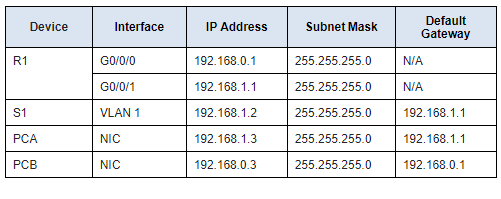
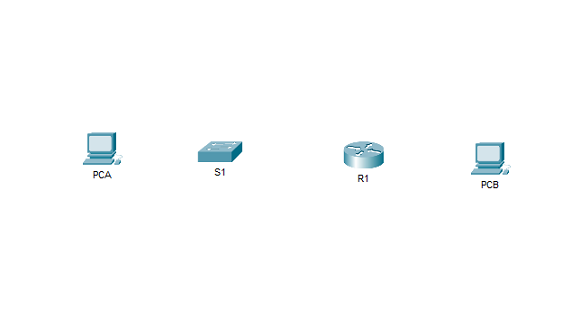
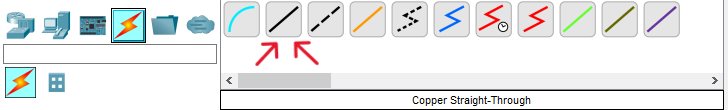
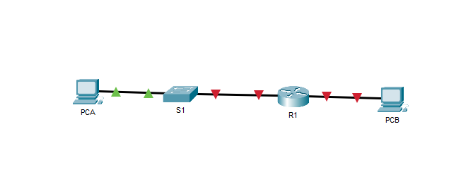
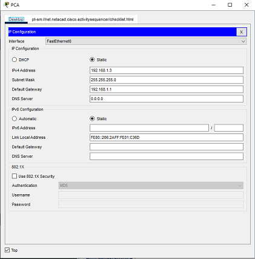
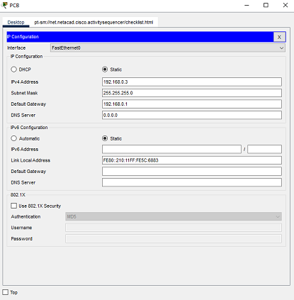
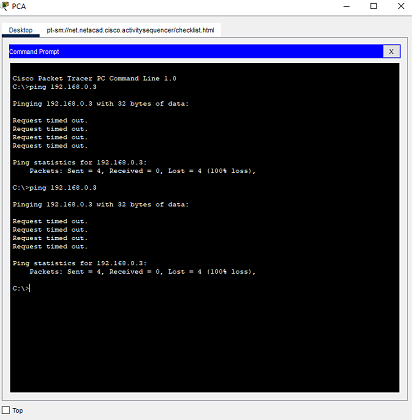
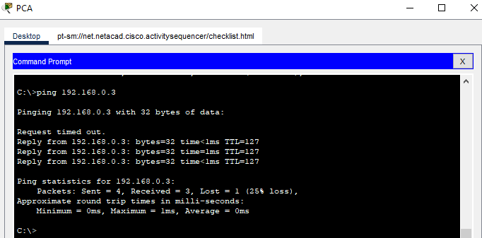
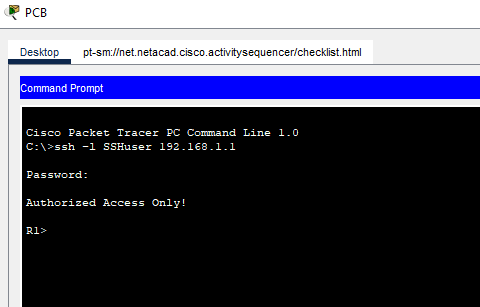

> This Cisco Packet Tracer lab is a property of the Cisco Networking Academy, [Skills for all with Cisco](https://skillsforall.com/ "Skills for all with Cisco"). This article seeks to bring solutions by displaying images and providing answers to the questions in the lab for better understanding.
> {: .prompt-info }

> Click the [Cisco Packet tracer file](https://skillsforall.com/content/ndic/1.0/courses/content/m11/en-US/assets/11.4.4-packet-tracer-tutored-activity---build-a-switch-and-router-network.pksz "Cisco Packet tracer file") to get the lab file to follow up with the solution.

### Objectives

1. Configure PCs.

2. Configure a router.

3. Verify end-to-end connectivity.

4. Configure a switch.

5. Secure remote access to the router.

### Background / Scenario

Your aunt owns a small insurance agency. She recently purchased a Cisco router and switch. She has two wired PCs that need to be connect to the network. She is proud of your progress in your networking course and asked you if you would like to demonstrate your skills. Your job is to connect the devices, implement a basic configuration, and verify connectivity. After network connectivity has been verified, you will use IOS commands to retrieve information from the devices to answer questions about your network equipment. You will also configure the router for secure remote access.

### Addressing Table

<p ></p>

## Instructions

## Part 1: Configure PCs.

### Step 1: Connect the devices.

<p ></p>

a. First, you will connect the devices using **Copper Straight-Through** cables.

<p ></p>

b. Connect **R1 G0/0/1** to any port on **S1**. Connect to the FastEthernet port of the switch

c. Connect to the FastEthernet port of **PCA** to any port on **S1**.

d. Connect to the FastEthernet port of **PCB** to **R1 G0/0/0**.

<p ></p>

### Step 2: Assign addresses to the PCs

In this step, you will assign static IPv4 addressing information to the PC interfaces. Use the information in the **Addressing Table** to complete the task.

a. Configure the IPv4 address, subnet mask, and default gateway settings on **PCA** .
Click on **PCA**, and click on IP Configuration in the Desktop tab.
The following values are found in the Addressing Table. Enter them in the IP Configuration for **PCA**.

- **IP Address**: 192.168.1.3
- **Subnet Mask**: 255.255.255.0
- **Default Gateway**: 192.168.1.1

<p ></p>

b. Configure the IPv4 address, subnet mask, and default gateway settings on **PCB** .
Click on **PCB**, same way you clicked on **PCA**, to open the IP Configuration of **PCB**.  
The following values are found in the Addressing Table. Enter them in the IP Configuration for **PCB** .

- **IP Address**: 192.168.0.3
- **Subnet Mask**: 255.255.255.0
- **Default Gateway**: 192.168.0.1

<p ></p>

### Test connectivity between **PCA** and **PCB**.

Ping between **PCA** and **PCB**.

In the **PCA** Command Prompt, enter the **ping 192.168.0.3** command. You can also open the **PCB** Command Prompt, and then enter the **ping 192.168.1.3** command.

<p ></p>

You will notice that the pings failed.

---

**Question 1**:  
Why were the pings not successful?

<details>
    <summary ><strong>Click here for answer</strong></summary>

    The router interfaces, which are the default gateways for each PC, have not been configured yet; therefore, the ping traffic is not being routed between the PCA and PCB networks. Note that link lights on the connections from the router are red. This indicates that the links are not functioning.

</details>

---

## Part 2: Configure a router.

In this step, you will use the **CLI** tab for **R1** to configure basic settings. You can connect a **Console** cable and access the CLI from **PCA** or **PCB**, if you wish. However, in this activity, you can also just click **R1** to open it.

a. Assign a hostname according to the **Addressing Table**.  
Click **R1**, in the **CLI** tab enter the following command:

```cli
Router> enable
Router# configure terminal
Router(config)# hostname R1
```

b. Assign **class** as the privileged EXEC encrypted password.  
Configure the privileged EXEC mode password in global configuration mode with the following command:

```cli
R1(config)# enable secret class
```

c. Assign **cisco** as the console password and enable login.  
Enter line configuration mode in global configuration mode and configure the console password with the following command:

```cli
R1(config)# line con 0
R1(config-line)# password cisco
R1(config-line)# login
```

d. Encrypt the plaintext passwords.  
Encrypt plaintext passwords with the following command in global configuration mode:

```cli
R1(config)# service password-encryption
```

e. Create a banner that warns anyone accessing the device that unauthorized access is prohibited.  
Configure a banner with the following command:

```cli
R1(config)# banner motd $Authorized Access Only!$
```

In this example, **$** is the delimiter.

f. For G0/0/0, configure IP addressing according to the
Addressing Table and activate the interface.  
Enter interface configuration mode and configure the G0/0/0 interface with the following command:

```cli
R1(config)# interface g0/0/0
R1(config-if)# ip address 192.168.0.1 255.255.255.0
R1(config-if)# no shutdown
```

g. For G0/0/1, configure IP addressing according to the
AddressingTable and activate the interface.  
First, enter **exit** to move out from the interface G0/0/0

```cli
R1(config-if)# exit
```

Enter interface configuration mode with the following command:

```cli
R1(config)# interface g0/0/1
R1(config-if)# ip address 192.168.1.1 255.255.255.0
R1(config-if)# no shutdown
```

h. Save the running configuration to the startup configuration file.  
Save the configuration with the following command:

```cli
R1(config)# exit
R1# copy running-config startup-config

Destination filename [startup-config]?
Building configuration...
[OK]
```

Click **Enter** to save in the **startup-config** filename

You can also use the abbreviated **copy run start** or the **write mem** command.

Close the R1 **CLI** tab.

## Part 3: Verify end-to-end connectivity.

Now, let's test connectivity between **PCA** and **PCB** again.

Ping between **PCA** and **PCB**.  
In the **PCA** Command Prompt, enter the **ping 192.168.0.3** command. You can also open the **PCB** Command Prompt, and then enter the **ping 192.168.1.3** command.

<p ></p>

It worked this time.

---

**Question 2**:  
Why were the pings between PCA and PCB successful?

<details>
    <summary ><strong>Click here for answer</strong></summary>

    The router is routing the ping traffic across the two networks. The default settings for the 2960 switch will automatically enable the interfaces that are connected to devices.

</details>

---

## Part 4: Configure a switch.

In this step, you will use the **CLI** tab for **S1** to configure basic settings. You can connect a console cable and access the **CLI** from **PCA** or **PCB**, if you wish. However, in this activity, you can also just click **S1** to open it.

a. Assign a hostname according to the **Addressing Table**.  
Click **S1**. Then enter the following command:

```cli
Switch> enable
Switch# configure terminal
Switch(config)# hostname S1
```

b. Assign **class** as the privileged EXEC encrypted password.  
Configure the privileged EXEC mode password in global configuration mode with the following command:

```cli
S1(config)# enable secret class
```

c. Assign **cisco** as the console password and enable login.  
Enter line configuration mode in global configuration mode with the following commands:

```cli
S1(config)# line con 0
S1(config-line)# password cisco
S1(config-line)# login
```

d. Encrypt the plaintext passwords.  
Encrypt plaintext passwords with the following command in global configuration mode:

```cli
S1(config)# service password-encryption
```

e. Create a banner that warns anyone accessing the device that unauthorized access is prohibited.  
Configure a banner with the following command:

```cli
R1(config)# banner motd $Authorized Access Only!$
```

In this example, **$** is the delimiter.

f. For VLAN 1, configure IP addressing according to the Addressing Table and activate the interface.  
Enter interface configuration mode with the following commands:

```cli
S1(config)# interface vlan 1
S1(config-if)# ip address 192.168.1.2 255.255.255.0
S1(config-if)# no shutdown
```

g. Configure the default gateway according to the **Addressing Table**.  
Configure the default gateway with the following command:

```cli
S1(config)# ip default-gateway 192.168.1.1
```

h. Save the running configuration to the startup configuration file.  
Save the configuration with the following command:

```cli
S1(config)# exit
S1# copy running-config startup-config
Destination filename [startup-config]?
Building configuration...
[OK]
```

Click **Enter** to save to the **startup-config** filename.  
You can also use the abbreviated **_copy run start_** or the **_write mem_** command

## Part 5: Secure remote access to the router.

### Step 1: Secure remote access to **R1**.

a. On **R1**, configure the domain name as **academy.net**.  
Log back in to **R1** with the password **cisco**, enter privileged EXEC mode with the password **class**.
Enter the following command:

```cli
R1(config)# ip domain-name academy.net
```

b. Generate RSA keys with a **1024** key length.  
Enter the following command to generate keys:

```cli
R1(config)# crypto key generate rsa

The name for the keys will be: R1.academy.net
Choose the size of the key modulus in the range of 360 to 4096 for your
  General Purpose Keys. Choosing a key modulus greater than 512 may take
  a few minutes.

How many bits in the modulus [512]: 1024

```

Enter **1024** as the key length.

c. Create a user with **SSHuser** as the username and **cisco** as the secret password.  
Enter the following command:

```cli
R1(config)# username SSHuser secret cisco
```

d. Configure the VTY lines to use the local username database for login credentials.  
The VTY lines should only allow SSH for remote access.  
Enter the following command:

```cli
R1(config)# line vty 0 4
R1(config-line)# login local
R1(config-line)# transport input ssh
```

### Step 2: Verify SSH remote access.

Now, let's verify SSH remote access.
From **PCA** or **PCB**, use the Command Prompt to establish a secure session with R1. At the prompt, use the **ssh** command.  
Click either **PCA** or **PCB**, open the Command Prompt, and then enter the following command:

```cli
C:\> ssh -l SSHuser 192.168.1.1
```

The password is **cisco**.

<p ></p>

You successfully verified that SSH is correctly configured on R1

---

**Question 3**:  
If the G0/0/1 interface status is administratively down, what interface configuration command would you use to activate the interface?

<details>
    <summary ><strong>Click here for answer</strong></summary>
        
    R1(config-if)# no shutdown

</details>

---

Question:

---

**Question 4**:  
What would happen if you had incorrectly configured interface G0/0/1 on the router with an IP address of 192.168.1.2?

<details>
    <summary ><strong>Click here for answer</strong></summary>

    PCA would not be able to ping PCB.
    This is because PCB is on a different network than PCA. A default-gateway router is required to route these packets. PCA is configured to use the IP address of 192.168.1.1 for the default-gateway router, but this address is not assigned to any device on the LAN. Any packets that need to be sent to the default-gateway for routing will never reach their destination.

</details>

---
