> This Cisco Packet Tracer lab is a property of the Cisco Networking Academy, [Skills for all with Cisco](https://skillsforall.com/ "Skills for all with Cisco"). This article seeks to bring solutions by displaying images and providing answers to the questions in the lab for better understanding.
> {: .prompt-info }

> Click the [Cisco Packet tracer file](https://skillsforall.com/content/ndic/1.0/courses/content/m11/en-US/assets/11.2.4-packet-tracer-configure-initial-router-settings.pka "Cisco Packet tracer file") to get the lab file to follow up with the solution.
> {: .prompt-tip }

### Objectives

Part 1: Verify the Default Router Configuration  
Part 2: Configure and Verify the Initial Router Configuration  
Part 3: Save the Running Configuration File

### Background

In this activity, you will perform basic router configuration tasks. You will secure access to the CLI and console port using encrypted and plain-text passwords. You will also configure messages for users who are logging into the router. These banners warn unauthorized users that access is prohibited. Finally, you will verify and save your running configuration.

## Instructions

## Part 1: Verify the Default Router Configuration

<p style="text-align:center">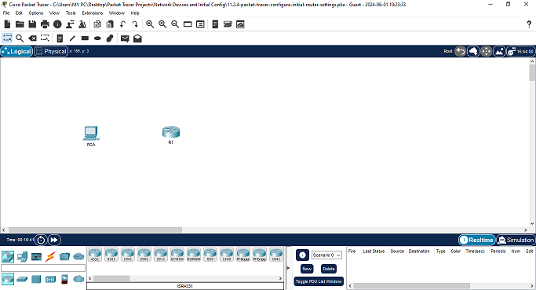</p>

### Step 1: Establish a console connection to R1.

a. Choose a **Console** cable from the available connections.

<p >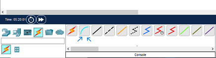</p>

b. Click **PCA** and select **RS 232**

<p >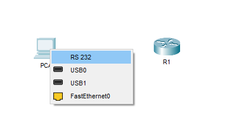</p>

c. Click **R1** and select **Console**

<p >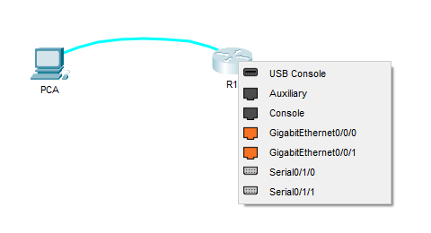</p>

d. Click **PCA** > **Desktop** tab > **Terminal**

e. Click **OK** and press **ENTER**. You are now able to configure **R1**.

<p >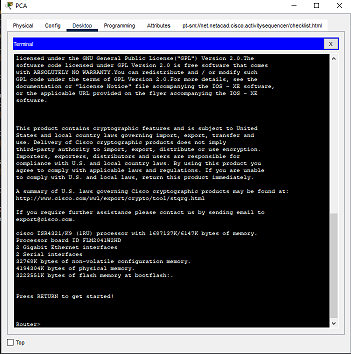</p>

### Step 2: Enter privileged mode and examine the current configuration

You can access all the router commands from privileged EXEC mode. However, because many of the privileged commands configure operating parameters, privileged access should be password-protected to prevent unauthorized use.

a. Enter privileged EXEC mode by entering the **enable** command

```cli
Router> enable
Router#
```

Notice the prompt changed in the configuration to reflect privileged EXEC mode.

b. Enter the **show running-config** config

<p >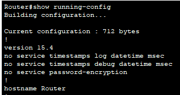</p>
<p >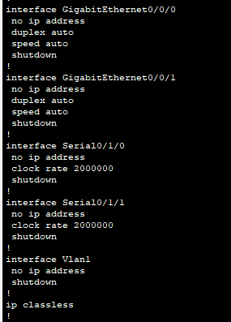</p>
<p >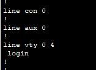</p>
 
___
**Question 1**:  
What is the router's hostname?  
<details>
    <summary ><strong>Click here for answer</strong></summary>

    Router.

</details>

---

**Question 2**:  
How many Fast Ethernet interfaces does the Router have?

<details>
    <summary ><strong>Click here for answer</strong></summary>

    none.

</details>

---

**Question 3**:  
How many Gigabit Ethernet interfaces does the Router have?

<details>
    <summary><strong>Click here for answer</strong></summary>

    2.

</details>

---

**Question 4**:  
How many Serial interfaces does the router have?

<details>
    <summary ><strong>Click here for answer</strong></summary>

    2.

</details>

---

**Question 5**:  
What is the range of values shown for the vty lines?

<details>
    <summary ><strong>Click here for answer</strong></summary>

    The range is 0 - 4.

</details>

---

c. Display the current contents of NVRAM.

```cli
Router# show startup-config
startup-config is not present
```

---

**Question 6**:  
Why does the router respond with the **startup-config is not present** message?

<details>
    <summary ><strong>Click here for answer</strong></summary>
    
    It displays this message because the configuration file was not saved to the NVRAM. Currently, it is only located in the RAM.

</details>

---

## Part 2: Configure and Verify the Initial Router Configuration

To configure parameters on a router, you may be required to move between various configuration modes. Notice how the prompt changes as you navigate through the IOS configuration modes.

### Step 1: Configure the initial settings on R1.

**Note**: The following tasks should be completed when configuring initial settings on a router.

1.  Configure the device name.

    ```cli
    Router(config)# hostname hostname
    ```

2.  Secure privileged EXEC mode.

    ```cli
    Router(config)# enable secret password
    ```

3.  Secure user EXEC mode.

    ```cli
    Router(config)# line console 0
    Router(config-line)# password password
    Router(config-line)# login
    ```

4.  Secure remote Telnet / SSH access.

    ```cli
    Router(config)# line vty 0 4
    Router(config-line)# password password
    Router(config-line)# login
    R1(config-line)# transport input ssh telnet
    ```

5.  Secure all passwords in the config file.

    ```cli
    Router(config-line)# exit
    Router(config)# service password-encryption
    ```

6.  Provide legal notification.

    ```cli
    Router(config)# banner motd delimiter message delimiter
    ```

    The legal notification warns users that the device should only be accessed by permitted users. Legal notification as an example is configured as follows :

    ```cli
    R1(config)# banner motd #
    Enter TEXT message. End with the character '#'.
    ***********************************************
    WARNING: Unauthorized access is prohibited!
    ***********************************************
    R1(config)#
    ```

7.  Save the configuration.

    ```cli
    Router# copy running-config startup-config
    ```

Open a configuration window, to continue the task

a. Configure **R1** as the hostname.

b. Configure Message of the day text: **Unauthorized access is strictly prohibited.**

c. Encrypt all plain text passwords.

Use the following passwords:

1.  Privileged EXEC, encrypted: **itsasecret**

2.  Console: **letmein**

### Step 2: Verify the initial settings on R1.

a. Verify the initial settings by viewing the configuration for R1.

---

**Question 7**:  
What command do you use?

<details>
    <summary ><strong>Click here for answer</strong></summary>

    show running-config.

</details>

---

b. Exit the current console session until you see the following message:

```cli
R1 con0 is now available

Press RETURN to get started.
```

c. Press **ENTER**; you should see the following message:

```cli
Unauthorized access is strictly prohibited.

User Access Verification

Password:
```

---

**Question 8**:  
Why should every router have a message-of-the-day (MOTD) banner?

<details>
    <summary ><strong>Click here for answer</strong></summary>

    Every router should have a banner to warn unauthorized users that access is prohibited. MOTD Banners can also be used to send messages to network personnel(such as impending system shutdowns or who to contact for access).

</details>

---

**Question 9**:  
If you are not prompted for a password before reaching the user EXEC prompt, what console line command did you forget to configure?

<details>
    <summary ><strong>Click here for answer</strong></summary>

    R1(config-line)#login.

</details>

---

d. Enter the passwords necessary to return to privileged EXEC mode.

---

**Question 10**:  
If you configure any more passwords on the router, are they displayed in the configuration file as plain text or in encrypted form? Explain.

<details>
    <summary ><strong>Click here for answer</strong></summary>

    The service password-encryption command encypts all current and future passwords.

</details>

---

## Part 3: Save the Running Configuration File

### Step 1: Save the configuration file to NVRAM.

Open a configuration window

a. You have configured the initial settings for **R1**. Now back up the running configuration file to NVRAM to ensure that the changes made are not lost if the system is rebooted or loses power.

---

**Question 11**:  
What command did you enter to save the configuration to NVRAM?

<details>
    <summary ><strong>Click here for answer</strong></summary>

    copy running-config startup-config.

</details>

---

**Question 12**:  
What is the shortest, unambiguous version of this command?

<details>
    <summary ><strong>Click here for answer</strong></summary>

    cop r st or copy run start.

</details>

---

**Question 13**:  
Which command displays the contents of the NVRAM?

<details>
    <summary ><strong>Click here for answer</strong></summary>

    show startup-configuration or show start

</details>

---

b. Verify that all the parameters configured are recorded. If not, analyze the output and determine which commands were not executed or were entered incorrectly. You can also click **Check Results** in the instruction window.

<p >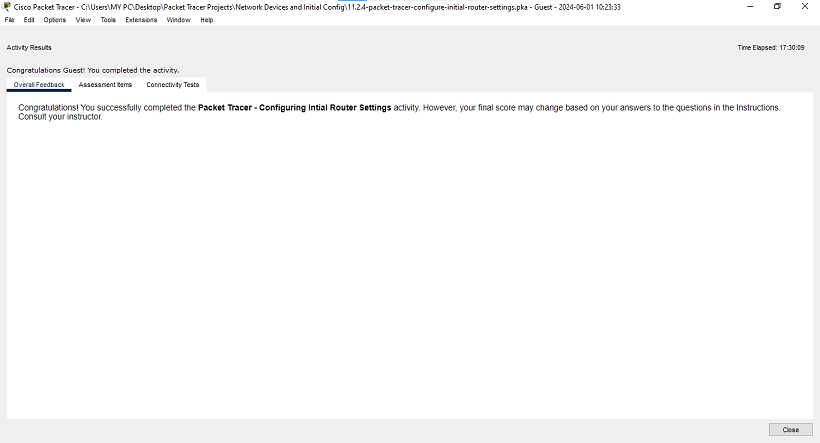</p>
<p >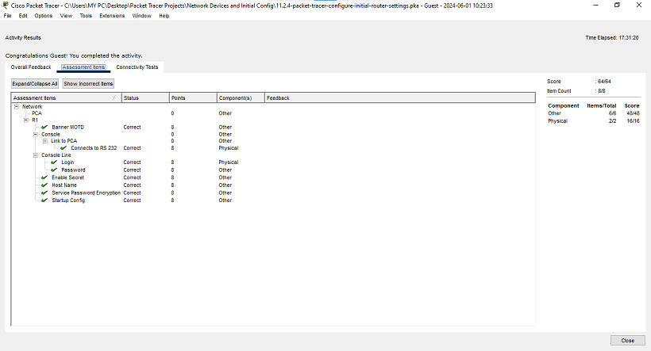</p>

### Step 2: Optional: Save the startup configuration file to flash.

Although you will be learning more about managing the flash storage in a router in later chapters, you may be interested to know that, as an added backup procedure, you can save your startup configuration file to flash. By default, the router still loads the startup configuration from NVRAM, but if NVRAM becomes corrupt, you can restore the startup configuration by copying it over from flash.

Complete the following steps to save the startup configuration to flash.

a. Examine the contents of flash using the **show flash** command:

```cli
R1# show flash
```

<p >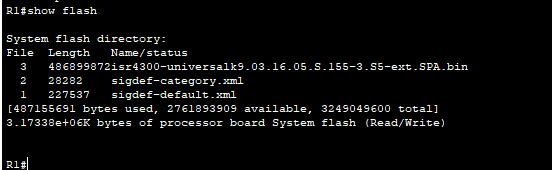</p>

**Question 14**:  
How many files are currently stored in flash?

<details>
    <summary ><strong>Click here for answer</strong></summary>

    3.

</details>

---

**Question 15**:  
Which of these files would you guess is the IOS image?

<details>
    <summary ><strong>Click here for answer</strong></summary>

    isr4300-universalk9.03.16.05.S.155-3.S5-ext.SPA.bin

</details>

---

**Question 16**:  
Why do you think this file is the IOS image?

<details>
    <summary ><strong>Click here for answer</strong></summary>

    Answers may vary, but two clues are, the file length compared to the others and the .bin at the end of the file name.

</details>

---

**Question 17**:  
b. Save the startup configuration file to flash using the following commands:

```cli
R1# copy startup-config flash

Destination filename [startup-config]
```

The router prompts you to store the file in flash using the name in brackets. If the answer is yes, then press **ENTER**; if not, type an appropriate name and press **ENTER**.

c. Use the **show flash** command to verify the startup configuration file is now stored in flash.

<p >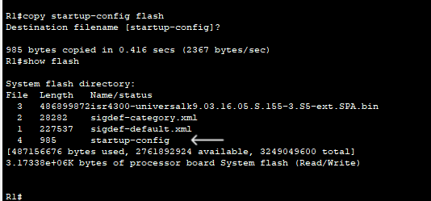</p>

Close the configuration window
