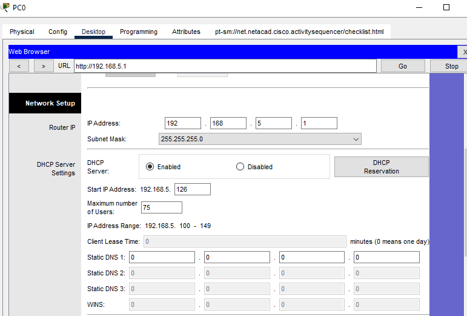

## Overview

{: .prompt-info }

> This Cisco Packet Tracer lab is a property of the Cisco Networking Academy, [Skills for all with Cisco](https://skillsforall.com/ "Skills for all with Cisco"). This article seeks to bring solutions by displaying images and providing answers to the questions in the lab for better understanding.
> {: .prompt-info }

{: .prompt-tip }

> Click the [Cisco Packet tracer file](https://skillsforall.com/content/nb/1.0/courses/content/m11/en-US/assets/11.2.3-packet-tracer---configure-dhcp-on-a-wireless-router.pka "Cisco Packet tracer file") to get the lab file to follow up with the solution.

### Objectives

- Connect 3 PCs to a wireless router

- Change the DHCP setting to a specific network range

- Configure the clients to obtain their address via DHCP

### Background / Scenario

A home user wants to use a wireless router to connect 3 PCs. All 3 PCs should obtain their address automatically from the wireless router.

### Instructions

### Part 1: Set up the network topology

a. Add three generic PCs.

b. Connect each PC to an Ethernet port to the wireless router using straight-through cables.

### Part 2: Observe the default DHCP settings

a. After the amber lights have turned green, click **PC0**. Click the **Desktop** tab. Select **IP Configuration**. Select **DHCP** to receive an IP address from **DHCP Enabled Router**.

{: width="351" height="354" }

---

**Question 1**:  
Record the IP address of the default gateway:

    
<strong>Click here for answer</strong>

    192.168.0.1

---

b. Close the **IP Configuration** window.

c. Open a Web Browser.

d. Enter the IP address of the default gateway recorded earlier into the URL field. When prompted, enter the username **admin** and password **admin**.

{: width="351" }

{: width="351" }

e. Scroll through the Basic Setup page to view default settings, including the default IP address of the wireless router.

f. Notice that DHCP is enabled, the starting address of the DHCP range and the range of addresses available to clients.

{: width="351" height="354" }

### Part 3: Change the default IP address of the wireless router.

a. Within the Router IP Settings section, change the IP address to: **192.168.5.1**.

{: width="351" height="354" }

b. Scroll to the bottom of the page and click **Save Settings**.

c. If it is done correctly, the web page will display an error message. Close the web browser.

d. Click **IP Configuration** to renew the assigned IP address. Click **Static**. Click **DHCP** to receive new IP address information from the wireless router.

{: width="351" height="354" }

e. Open the web browser, enter the IP address **192.168.5.1** in the URL field. When prompted, enter the username **admin** and password **admin**.

{: width="351" height="354" }

### Part 4: Change the default DHCP range of addresses.

a. Notice the DHCP Server Start IP Address is updated to the same network as the Router IP.

b. Change the Starting IP Address from 192.168.5.100 to **192.168.5.126**.

c. Change the Maximum Number of Users to **75**.

{: width="351" height="354" }

d. Scroll to the bottom of the page and click **Save Settings**. Close the web browser.

e. Click **IP Configuration** to renew the assigned IP address. Click **Static**. Click **DHCP** to receive new IP address information from the wireless router.

{: width="351" height="354" }

f. Select **Command Prompt**. Enter **ipconfig**.

{: width="351" height="354" }

---

**Question 2**:  
Record the IP address for PC0:

    
<strong>Click here for answer</strong>

    192.168.5.126

---

### Part 5: Enable DHCP on the other PCs.

a. Click **PC1**.

b. Select **Desktop** tab.

c. Select IP Configuration.

d. Click **DHCP**.

{: width="351" height="354" }

---

**Question 3**:  
Record the IP address for PC1:

    
<strong>Click here for answer</strong>

    192.168.5.127

---

e. Close the configuration window.

f. Enable DHCP on **PC2** following the steps for PC1.

{: width="351" height="354" }

### Part 6: Verify connectivity

a. Click **PC2** and select the **Desktop** tab.

b. Select Command Prompt.

c. Enter **ipconfig** at the prompt to view the IP configuration.

{: width="351" height="354" }

d. At the prompt, enter **ping 192.168.5.1** to ping the wireless router.

e. Enter **ping 192.168.5.126** to ping PC0 at the prompt.

{: width="351" height="354" }

f. At the prompt, enter **ping 192.168.5.127** to ping PC1.

{: width="351" height="354" }

g. The pings to all devices should be successful.
