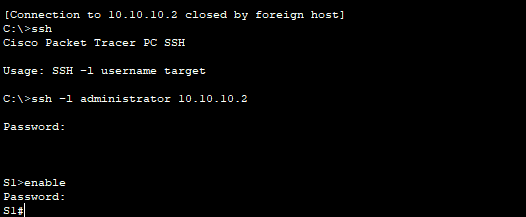

## Overview

{: .prompt-info }

> This Cisco Packet Tracer lab is a property of the Cisco Networking Academy, [Skills for all with Cisco](https://skillsforall.com/ "Skills for all with Cisco"). This article seeks to bring solutions by displaying images and providing answers to the questions in the lab for better understanding.
> {: .prompt-info }

{: .prompt-tip }

> Click the [Cisco Packet tracer file](https://skillsforall.com/content/ndic/1.0/courses/content/m11/en-US/assets/11.3.6-packet-tracer-configure-ssh.pka "Cisco Packet tracer file") to get the lab file to follow up with the solution.

### Objectives

Part 1: Secure Passwords

Part 2: Encrypt Communications

Part 3: Verify SSH Implementation

### Background / Scenario

SSH should replace Telnet for management connections. Telnet uses insecure plain text communications. SSH provides security for remote connections by providing strong encryption of all transmitted data between devices. In this activity, you will secure a remote switch with password encryption and SSH.

### Addressing Table

| Device | Interface | IP Address  | Subnet Mask   |
| :----- | :-------- | :---------- | :------------ |
| S1     | VLAN 1    | 10.10.10.2  | 255.255.255.0 |
| PC1    | NIC       | 10.10.10.10 | 255.255.255.0 |

### Instructions

### Part 1: Secure Passwords


a. Using the command prompt on **PC1**, Telnet to **S1**. The user EXEC and privileged EXEC password is cisco.

```terminal
PC> telnet 10.10.10.2

Trying 10.10.10.2 ...Open

User Access Verification

Password:

S1> en

Password:

S1#
```

b. Save the current configuration so that any mistakes you might make can be reversed by toggling the power for **S1**.

```terminal
S1# copy running-config startup-config

Destination filename [startup-config]?

Building configuration...

[OK]
```

c. Show the current configuration and note that the passwords are in plain text.

{: width="351" height="354" }

{: width="351" height="354" }

d. In the global configuration mode, enter the command that encrypts plain text passwords:

```terminal
S1(config)# service password-encryption
```

e. Verify that the passwords are encrypted.

{: width="351" height="354" }

{: width="351" height="354" }

### Part 2: Encrypt Communications

#### Step 1: Set the IP domain name and generate secure keys.

It is generally not safe to use Telnet, because data is transferred in plain text. Therefore, use SSH whenever it is available.

a. Configure the domain name to be **netacad.pka**.

```terminal
S1(config)# ip domain-name netacad.pka
```

b. Secure keys are needed to encrypt the data. Generate the RSA keys using a 1024 key length.

```terminal
S1(config)# crypto key generate rsa

The name for the keys will be: S1.netacad.pka

Choose the size of the key modulus in the range of 360 to 2048 for your

General Purpose Keys. Choosing a key modulus greater than 512 may take a few minutes.

How many bits in the modulus [512]: 1024

% Generating 1024 bit RSA keys, keys will be non-exportable...[OK]
```

{: width="351" height="354" }

#### Step 2: Create an SSH user and reconfigure the VTY lines for SSH-only access.

a. Create an **administrator** user with **cisco** as the secret password.

```terminal
S1(config)# username administrator secret cisco
```

b. Configure the VTY lines to check the local username database for login credentials and to only allow SSH for remote access. Remove the existing vty line password.

```terminal
S1(config)# line vty 0 15

S1(config-line)# login local

S1(config-line)# transport input ssh

S1(config-line)# no password cisco
```

### Part 3: Verify SSH Implementation

a. Exit the Telnet session and attempt to log back in using Telnet. The attempt should fail.

{: width="351" height="354" }

b. Attempt to log in using SSH. Type **ssh** and press **Enter** without any parameters to reveal the command usage instructions. Hint: The **-l** option is the letter “L”, not the number 1.

c. Upon successful login, enter privileged EXEC mode and save the configuration. If you were unable to successfully access **S1**, toggle the power and begin again at Part 1.

{: width="351" height="354" }
