## Overview

{: .prompt-info }

> This Cisco Packet Tracer lab is a property of the Cisco Networking Academy, [Skills for all with Cisco](https://skillsforall.com/ "Skills for all with Cisco"). This article seeks to bring solutions by displaying images and providing answers to the questions in the lab for better understanding.
> {: .prompt-info }

{: .prompt-tip }

> Click the [Cisco Packet tracer file](https://skillsforall.com/content/nb/1.0/courses/content/m14/en-US/assets/14.3.4-packet-tracer-create-lan.pka "Cisco Packet tracer file") to get the lab file to follow up with the solution.

### Objectives

- Connect Network Devices and Hosts

- Configure Devices with IPv4 Addressing

- Verify the End Device Configuration and Connectivity

- Use Networking Commands to View Host Information

### Background / Scenario

A new branch office is opening, and you have been asked to set up the LAN. The network devices are already set up, but you need to connect them and the hosts together. You also need to configure IPv4 addressing on the end devices and verify that they can reach local and remote resources.

### Address table

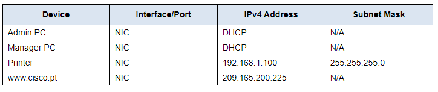

### Instructions

### Part 1: Connect Network Devices and Hosts

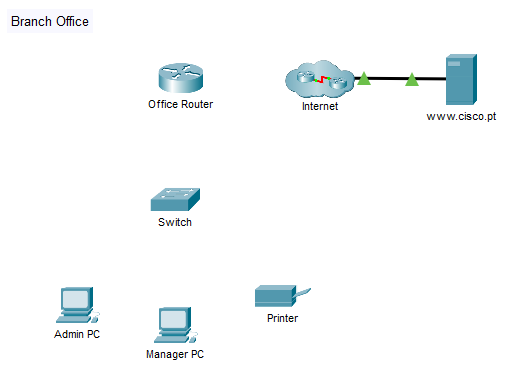

#### Step 1: Power on the end devices and Office Router.

a. Click each device and open its Physical Tab.

{: .prompt-info }

> There is no power switch on the switch model used in this activity.

b. Locate the power switch for each device in the Physical Device View window.

c. Click the power switch to turn the device on. You should see a green light near the power switch to indicate that the device is powered on.

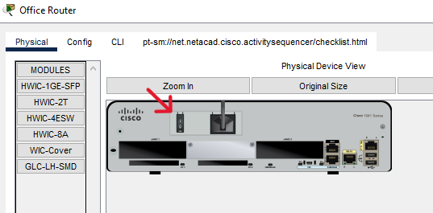{: width="500" height="527" }

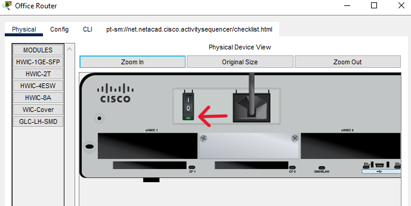{: width="500" height="527" }

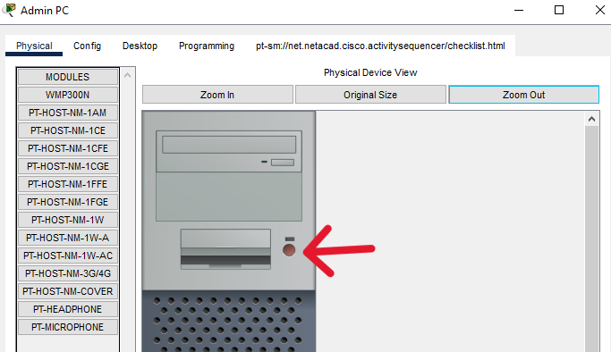{: width="500" height="527" }

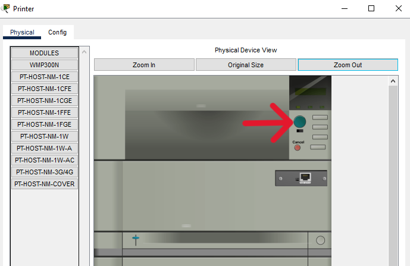{: width="500" height="527" }

#### Step 2: Connect the end devices.

Use the table and instructions to connect the network devices and hosts to create the physical network.

**Connections Table**

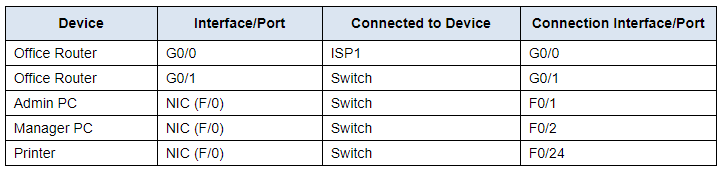

{: .prompt-tip }

> In the table above, interfaces designated with **G** are GigabitEthernet interfaces. Interfaces that are designated with **F** are FastEthernet interfaces.

a. Connect the networking devices according to the information in the **Connections Table** using Ethernet copper straight-through cables. For the internet to Office Router connection, select the device and port from the dropdown menus that appear when you click the cloud with connections tool selected.

b. Connect the two PCs and the printer to the office switch according to the information in the connections table. Use copper straight-through cables.

c. You should see green link lights on all connections after a brief delay.

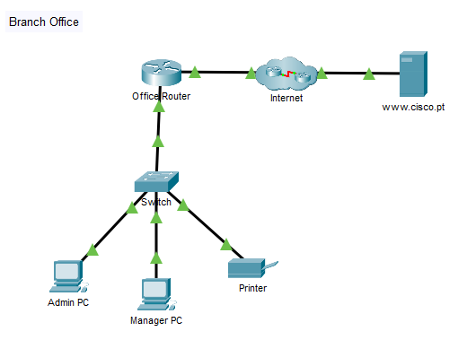

### Part 2: Configure Devices with IPv4 Addressing

#### Step 1: Configure the hosts with addressing information.

a. The Admin and Manager PCs should receive their IP addressing information from DHCP. The Office Router has been configured to supply IP addresses to hosts on the branch office LAN. Click the PCs and go to the Desktop tabs on each PC. Open the IP Configuration application and configure the PCs to receive their IP addresses dynamically.

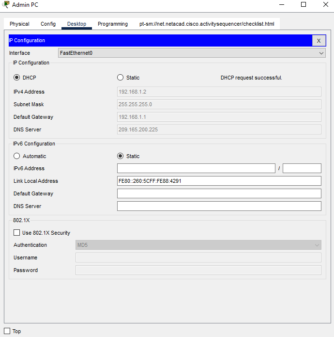{: width="400" height="427" }

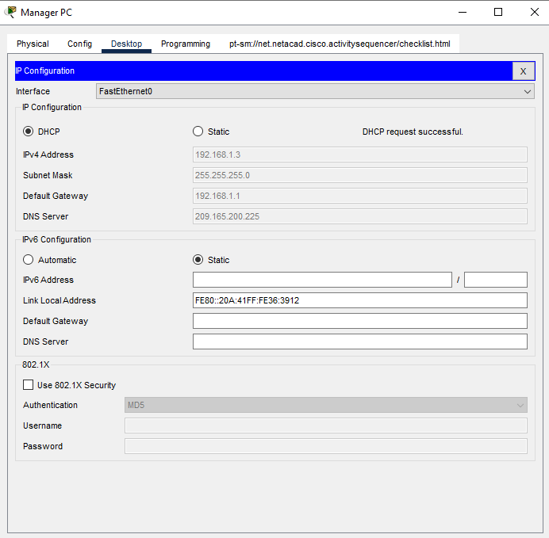{: width="400" height="427" }

b. Printers and servers are often manually configured with addressing because other devices on the network are configured to access them using IP addresses. Manual configuration with a static address will ensure that the IP addresses of these devices do not change.

1.  Click the printer and open the Config tab.

2.  Click the FastEthernet0 interface in the left-hand pane.

3.  Enter the addressing information from the Addressing Table.

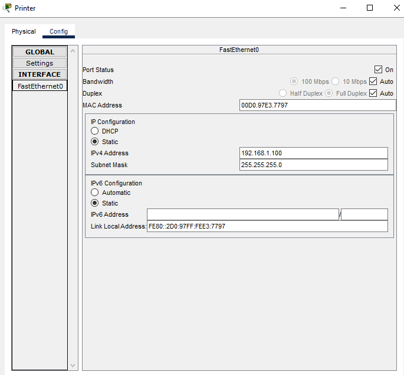{: width="400" height="427" }

c. Because the two computers are on the same network, their IPv4 addresses will be similar, their subnet masks and default gateways will be identical.

---

**Question 1**:  
Why do you think the IPv4 addresses are different, but the subnet masks and default gateways are the same?

    
<strong>Click here for answer</strong>

    Answers will vary. Each device on the network must have a unique identifier. The IPv4 address is one way of uniquely identifying each network host or device. The default gateway represents the way of communicating with devices that are NOT on the local network.

---

The printer does not require a default gateway because it will only be accessed by hosts on the local network. However, if you need to configure it with a default gateway, which value will the printer use?

---

**Question 2**:  
How can you determine this from the other devices in the network?

    
<strong>Click here for answer</strong>

    You can determine the default gateway value to use by looking at the values that PCs have been configured with by DHCP, or by determining the IP address of the Office Router Ethernet interface that is connected to the branch office LAN.

---

### Part 3: Verify the End Device Configuration and Connectivity

#### Step 1: Verify connectivity between the two PCs.

a. Go to the desktops of the PCs and check the IP addressing configuration. You should see that the PCs have dynamically received IP addresses on the 192.168.1.0 255.255.255.0 network. You should also see that they have received addresses for the Default Gateway and DNS server settings.

b. From the command prompt on Admin PC, ping the IP address of the Printer. Repeat this process for the Manager PC. You should see successful pings for each. This verifies that the PCs and the printer are powered on, and correctly connected and addressed.

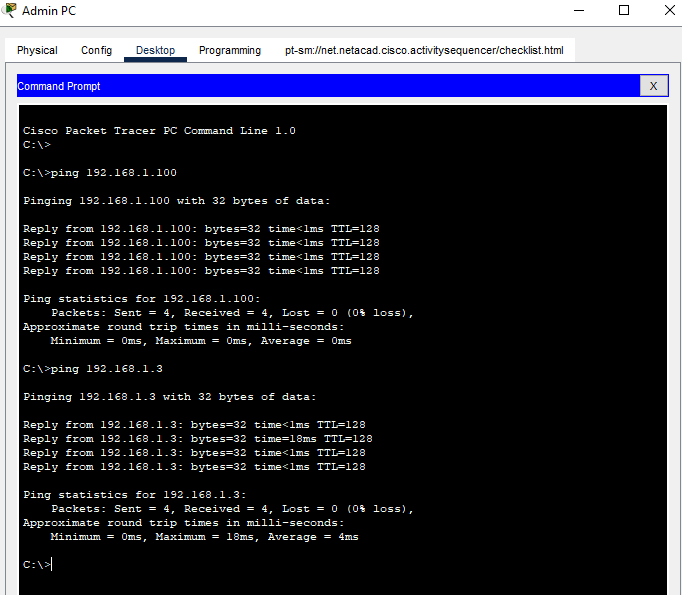{: width="400" height="427" }

#### Step 2: Verify connectivity to the internet.

From the desktop of the PCs, open the Web Browser. Enter the IP address of the internet server to display the webpage. Repeat the process but connect using the URL of the server.

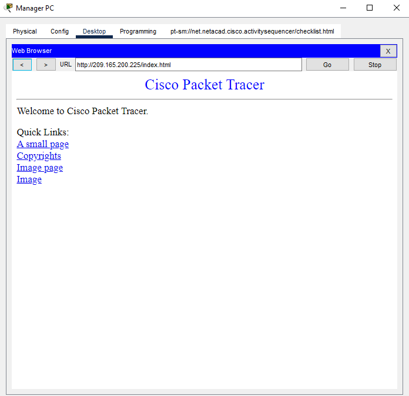{: width="400" height="427" }

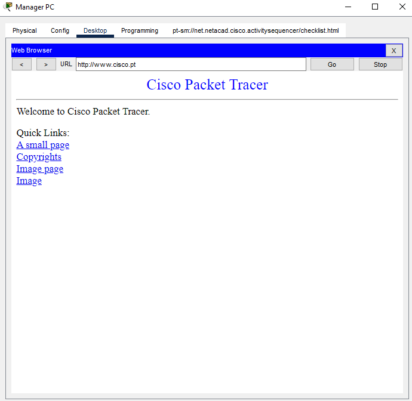{: width="400" height="427" }

---

**Question 3**:  
If you can connect by the IP address, but not by the URL, what do you think is the cause of this problem?

    
<strong>Click here for answer</strong>

    Because DNS is used to resolve URLs to IP addresses, you can safely guess that the DNS server is not reachable. This could be because of a network connectivity issue, or it could be because the DNS server address that is configured on the hosts is missing or incorrect.

---

### Part 4: Use Networking Commands to View Host Information

The networking commands that are available from command prompt on PCs are very similar to those that are available in Windows. In this part of the activity, you will use **ipconfig** and **tracert** to learn more about the LAN.

#### Step 1: Use the ipconfig command.

The **ipconfig** command displays details about the addressing that is configured on a host.

Open a command prompt on one of the PCs and enter the **ipconfig** command and make note of the information that is returned. Now enter the **ipconfig /all** command.

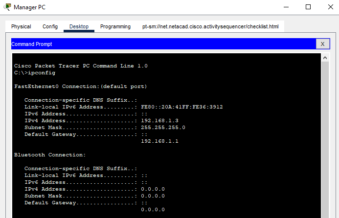{: width="500" height="527" }

---

**Question 4**:  
 What additional information is displayed?

    
<strong>Click here for answer</strong>

    The ipconfig /all displays information about the physical (MAC) address of the NIC. It also displays the DHCP and DNS server addresses. In Windows, many additional details are displayed. Type ipconfig /all from the command prompt of a PC to view all the information that Windows displays with this command.

---

#### Step 2: Use the tracert command.

The **tracert** command uses ICMP to return information about the routers that are passed as packets go from the source PC to the destination.

Trace to a remote destination by going to one of the PCs and entering **tracert** followed by the URL of the web server.

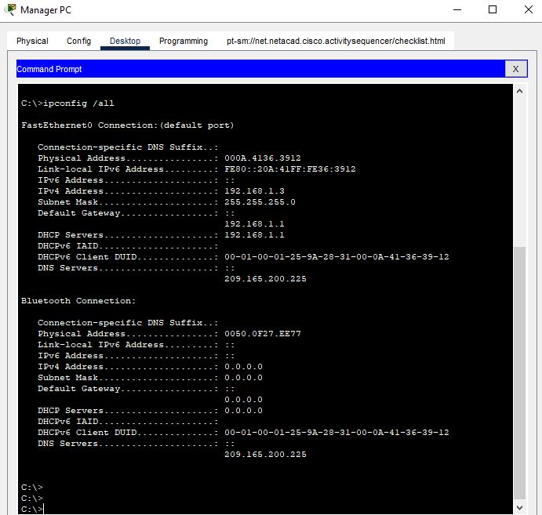{: width="500" height="527" }

---

**Question 4**:  
How many routers are passed on the way to the destination? How are those routers identified?

    
<strong>Click here for answer</strong>

    Two. They are identified by the IP addresses of the incoming interfaces on the routers.

---

**Question 5**:  
Where is the second router located?

    
<strong>Click here for answer</strong>

    It is in the internet cloud.

---

**Reflection**:  
Consider a small office that has a LAN similar to the one you have created here. What is the biggest facilities challenge in setting up the network in a new location?

    
<strong>Click here for answer</strong>

    The physical cabling infrastructure. The office needs to be wired and have communication outlets for all devices. Moreover, the outlets need to be in convenient locations. Further, the outlets must be wired to some central location where the switch and router are located. Physical cabling can present many problems when created a new office location.

