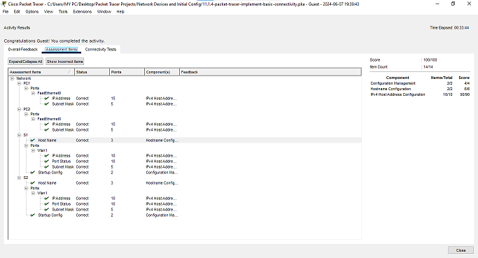

## Overview

{: .prompt-info }

> This Cisco Packet Tracer lab is a property of the Cisco Networking Academy, [Skills for all with Cisco](https://skillsforall.com/ "Skills for all with Cisco"). This article seeks to bring solutions by displaying images and providing answers to the questions in the lab for better understanding.
> {: .prompt-info }

{: .prompt-tip }

> Click the [Cisco Packet tracer file](https://skillsforall.com/content/ndic/1.0/courses/content/m11/en-US/assets/11.1.4-packet-tracer-implement-basic-connectivity.pka "Cisco Packet tracer file") to get the lab file to follow up with the solution.

### Addressing Table

| Device | Interface | IP Address    | Subnet Mask   |
| :----- | :-------- | :------------ | :------------ |
| S1     | VLAN 1    | 192.168.1.253 | 255.255.255.0 |
| S2     | VLAN 1    | 192.168.1.254 | 255.255.255.0 |
| PC1    | NIC       | 192.168.1.1   | 255.255.255.0 |
| PC2    | NIC       | 192.168.1.2   | 255.255.255.0 |

### Objectives

Part 1: Perform a Basic Configuration on S1 and S2

Part 2: Configure the PCs

Part 3: Configure the Switch Management Interface

### Background / Scenario

In this activity, you will first perform basic switch configurations. Then you will implement basic connectivity by configuring IP addressing on the switches and PCs. When the IP addressing configuration is complete, you will use various **show** commands to verify configurations and use the ping command to verify basic connectivity between devices.

### Instructions

### Part 1: Perform SVI Configuration on S1 and S2


Click the Fastforward icon to turn the connections to green,


Or, you wait for few seconds to allow the connections automatically turn green.


#### Step 1: Configure S1 with a hostname.

Open configuration window

a. Click **S1**, and then click the **CLI** tab.


b. Enter the privileged EXEC mode. Then enter the global configuration mode.

```terminal
Switch> enable

Switch# configure terminal

Enter configuration commands, one per line. End with CNTL/Z.
```

c. Configure the hostname as **S1**.


```terminal
Switch(config)# hostname S1

S1(config)#
```

#### Step 2: Configure S1 with an IP address.

Switches can be used without any configurations. Switches forward information from one port to another based on Media Access Control (MAC) addresses.

---

**Question 1**:
Why does a switch need an IP address?

<details>
    <summary ><strong>Click here for answer</strong></summary>

    An IP address is required to connect to a switch remotely. The switch is managed through VLAN1 by default.

</details>

---

a. In the global configuration mode, enter the following commands to configure S1 with an IP address in VLAN 1.

```terminal
S1(config)# interface vlan 1

S1(config-if)# ip address 192.168.1.253 255.255.255.0

S1(config-if)# no shutdown

%LINEPROTO-5-UPDOWN: Line protocol on Interface Vlan1, changed state to up
```

---

**Question 2**:
What does the **no shutdown** command do?

<details>
    <summary ><strong>Click here for answer</strong></summary>

    The no shutdown command administratively enables the interface to an active state.

</details>

---

b. Exit the configuration mode and save the configuration.

```terminal
S1(config-if)# end

S1#

S1# copy running-config startup-config

Destination filename [startup-config]?

Building configuration...

[OK]
```

c. Verify the IP address configuration on S1.

```terminal
S1# show ip interface brief

<output omitted>

Vlan1 192.168.1.253 YES manual up up
```


close the configuration window

#### Step 3: Configure S2 with a hostname and IP address.

In this step, you will configure S2 with a hostname and IP address.

open configuration window

a. Click **S2**. In the CLI tab, enter the global configuration mode.

b. Configure the switch **S2** with a hostname using the information according to the Addressing Table.


c. Use the information in the Addressing Table, repeat the same process to configure the switch S2 with an IP address.

d. Exit the configuration mode. Verify the IP address configuration on S2.

```terminal
S2# show ip interface brief

<output omitted>

Vlan1 192.168.1.254 YES manual up up
```


e. Save the configuration file to NVRAM. Enter the **copy running-config startup-config** command to save the configuration.

close configuration window

### Part 2: Configure the PCs

In this part, you will configure PC1 and PC2 with IP addresses and verify network connectivity.

#### Step 1: Configure both PCs with IP addresses.

a. Click **PC1**, and then click the **Desktop** tab.

b. Click **IP Configuration**. In the **Addressing Table** above, you can see that the IP address for PC1 is supposed to be 192.168.1.1 and the subnet mask 255.255.255.0. Enter this information for PC1 in the **IP Configuration** window.


c. Repeat the previous steps for PC2. Use the IP address listed in the Address Table for PC2.


#### Step 2: Test connectivity from the PCs.

a. Click **PC1**. Close the **IP Configuration** window if it is still open. In the **Desktop** tab, click **Command Prompt**.

b. Enter the **ping** command and the IP address for S1.

```terminal
Packet Tracer PC Command Line 1.0

PC> ping 192.168.1.253
```

---

**Question 3**:
Were you successful? Explain.

<details>
    <summary ><strong>Click here for answer</strong></summary>

    It should not be successful because the switches have not been configured with an IP address.

</details>

---

f. From PC1, ping S2 and PC2.

g. Repeat the pings to S1, S2, and PC1 from PC2.

{: .prompt-tip }

> All pings should be successful. If your first ping result is 80%, retry; it should now be 100%. You will learn why a ping may fail the first time later in your studies. If you are unable to ping any of the devices, check your configuration for errors.

#### Step 3: Verify network connectivity from the switches.

Network connectivity can be verified using the **ping** command. It is very important that connectivity exists throughout the network.

a. From S1, ping the other devices in the network. The ping to PC1 is displayed below as an example.

```terminal
S1> ping 192.168.1.1

Type escape sequence to abort.

Sending 5, 100-byte ICMP Echos to 192.168.1.1, timeout is 2 seconds:

!!!!!

Success rate is 100 percent (5/5), round-trip min/avg/max = 0/0/1 ms
```

b. From S2, ping the other devices in the network.

{: .prompt-tip }

> All pings should be successful. If your first ping result is 80%, retry; it should now be 100%. If you are unable to ping any of the devices, check your configuration for errors.
> Click the **Check Results** button to see if you completed the tasks of the lab.


