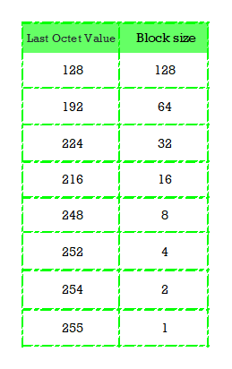

### Goal

Upon the completion of this project, you will be able to do a simple office networking projects and test for connectivity.

### Prior Knowledge

Prior to this project, you have learned the basics of computer networking, the configurations of networking devices and the binary-decimal system conversion.

### Case Study

Design a simple office network in Cisco packet tracer to connect **HUMAN RESOURCE (HR)** and **FINANCE (FIN)** departments through the following;  
a. The configurations of the host devices should be separately done statically and dynamically(using DHCP).

b. Each department should contain at least four(4) PCs and a printer

c. Use appropriate number of switches and routers in the network.

d. Connect all devices in the network using the appropriate cables.

d. Using the given network address 192.168.16.0, configure all router interfaces manually with the appropriate IP addresses, subnet mask and gateways.

f. Test the connectivity between HUMAN RESOURCE (HR) and FINANCE (FIN) departments. PCs in FIN department should be able to ping the PCs in the HR department.

### Objectives

- Design the topology for the network connections
- Identify Subnets, Subnet masks and range of valid IP addresses.
- Configure the Router
- Configure the PCs and Printers using either static or dynamic configurations
- Test connectivity between devices

### Instructions

### Part 1: Design the topology for the network connections

#### Step 1: Provide the network devices needed

a. Select on the workspace, your preferred positions for the two departments, one at the left and the other on the right.

b.Select one switch for each department, and place them in the departments

c. Select the four PCs and a printer for the departments

d. Select an appropriate router placing it directly above the center of the two switches.

b. Select the **Draw Ellipse** icon to draw freeform that will properly indicate each department.

c. Rename the devices according to your preferred specifications by clicking on the name description box of each device or continue with the default names of the devices.

#### Step 2: Connect the devices with network cables.

{: .prompt-info }

> For the same network devices, use the **Copper Straight-Through** cable, while, for different network devices, use the **Copper Cross-Over** cable, connecting to the ethernet ports of each device.
>
> To configure the router or switch from your PC, you connect using the **Console** cable, connecting to the **RS** port the of the PC and **Console** port of the the router or switch.
>
> However, you can preferably use the "Lightening bolt" icon of the cables to automatically connect using the appropriate cable.

a. Connect the router to the switches by clicking on the **Connections** of the Network Components, then choose the lightening bolt icon to connect.

b. Using the same lightening bolt icon, connect the switches of the departments to their respective PCs and printers.


{: .prompt-tip }

> Notice the indicators from the router to the switches still showing red and the the ones from the switches to the PCs and printers show green after some time.

### Part 2: Identify Subnets, Subnet masks and range of valid IP addresses.

To identify the appropriate ip addresses, subnet masks and default gateways of the devices using the network address 192.168.16.0, we must first seek to discover, the number of subnets, subnet mask, the range of valid ip addresses for the hosts, the default gateways, network id and broadcast id of the network 192.168.16.0.  
Finding these, will be essential when statically configuring the host devices, and also dynamically, when creating a dhcp network pool (range of valid ip addresses) for the subnets, that will be used to automatically assign addresses to the host devices.

{: .prompt-tip }

> Note that the number of subnet is equal to the number of departments

Now, using the formula for subnets,

{: .prompt-tip }

> **2<sup>n</sup>** = **number of subnets**
>
> where, **n** **: the number of borrowed network bits**.
>
> **n**, must be a number that gives a value that is equal to the number of subnets or closely higher than the number of subnets.

Hence, if the number of subnet is 2, then **n** will be 1.

Recall that 255.255.255.255 is,

```
        255     .255     .255    .255
        11111111.11111111.1111111.1111111

```

For 1 borrowed network bits from the host network, the remaining host bits wil be 7 in the octet, that is;

```
                Network part      | Host part
        11111111.1111111.1111111.1|0000000
                                  |
```

Converting to decimal, you have

```
      11111111.1111111.1111111.10000000
      255     .255    .255    .128
```

255.255.255.128, hence this is the subnet mask with a notation of /25(there are 25 network bits when counted)  
Therefore, subnet mask is **255.255.255.128/25**

Recall also, the subnet mask and block size relationship.  
Block size is the number of ip addresses in a given subnet.  
In this relationship, the last octet value of the subnet mask should give a block size, such that when summed up together, gives a value of 256.  
This method is used to know the range of valid ip addresses for the host devices, the network id and the broadcast id of a particular subnets of a network.



### **First Subnet**

**Subnet Mask** : 255.255.255.128  
**Network ID** : 192.168.16.0  
**Range of valid Host IP addresses** : 192.168.16.1 - 192.168.16.126  
Broadcast ID : 192.168.16.127

### **Second Subnet**

**Subnet Mask** : 255.255.255.128  
**Network ID** : 192.168.16.128  
**Range of valid Host IP addresses** : 192.168.16.129 - 192.168.16.254  
Broadcast ID : 192.168.16.255

{: .prompt-tip }

> Identify by labelling each subnets/departments with their respective network id/notation


### Part 3: Configure the Router

#### Step 1: Configure initial basic router settings.

In this step, you will use the **CLI** tab for **Office-Router** to configure the router. Enter the following commands step by step to configure the router.

a. Click the **Office-Router**, in the **CLI** tab, assign the hostname

```terminal
Router> enable
Router# configure terminal
Router(config)# hostname Office-Router
```

b. Configure the privileged EXEC mode secret by assigning **office** as the privileged EXEC encrypted secret password:

```terminal
Office-Router(config)# enable secret office
```

c. Enter line configuration mode in global configuration mode and configure the console by assigning the **admin** as the console password and enable login. Also, enable logging synchronous to prevent unnecessary login information and the exec-timeout to log out after a certain duration of inactivity.

```terminal
Office-Router(config)# line con 0
Office-Router(config-line)# password admin
Office-Router(config-line)# login
Office-Router(config-line)# logging synchronous
Office-Router(config-line)# exec-timeout 5 0
```

{: .prompt-tip }

> the exec-timeout command means the console will logout after 5mins 0sec of inactivity.

d. Inspect the running configuration to see that the passwords are in plaintext

```terminal
Office-Router(config-line)# do show running-config
```

e. Encrypt the plaintext passwords.
First exit the line configuration mode to go back to the global configuration mode, then encrypt the plaintext passwords

```terminal
Office-Router(config-line)# exit
Office-Router(config)# service password-encryption
```

e. Create a banner that warns anyone accessing the device that unauthorized access is prohibited. Use **$** as the delimeter

```terminal
Office-Router(config)# banner motd $Unauthorized Access is Prohibited!$
```

#### Step 2: Configure the router interfaces

Hover the cursor on the cable at each side of the router to reveal the interface connected to each switch of the departments. From my project, the interfaces are Gig0/0/0(also,G0/0/0) connected to the HR department and Gig0/0/1(also,G0/0/1) connected to the FIN department.

a. Activate the interfaces of the router

```terminal
Office-Router(config)# interface range g0/0/0-1
Office-Router(config-if-range)# no shutdown
```

{: .prompt-tip }

> Notice, that the interface indicators turn green

b. For G0/0/0, configure IP addressing according to the first subnet and give a description of the interface.

```terminal
Office-Router(config)#interface g0/0/0
Office-Router(config-if)#ip address 192.168.16.1 255.255.255.128
Office-Router(config-if)#description "This interface is connected to the HR department"
```

c. For G0/0/1, configure IP addressing according to the
second subnet and give a description of the interface.

```terminal
Office-Router(config-if)#interface g0/0/1
Office-Router(config-if)#ip address 192.168.16.129 255.255.255.128
Office-Router(config-if)#description "This interface is connected to the FIN department"
```

d. Save the running configuration to the startup configuration file.  
Save the configuration with the following command:

```terminal
Office-Router(config-if)#do write

Building configuration...
[OK]
```

Click **Enter** to save in the **startup-config** file

e. Check if the configuration in the startup configuration file is saved.

```terminal
Office-Router(config-if)#exit
Office-Router(config)#do show startup-config
```

### Part 4: Configure the PCs and Printers

In this part, you will either choose to configure the host devices statically or dynamically and not both at the same time. We will now go through each configuration method.

### Static Configurations

You will manually assign the IP addresses, subnet mask and default gateways to the devices in each subnets/departments.

{: .prompt-tip }

> The ip addresses of the router interfaces will be the default gateway of the each department connected on the interface

#### Step 1: Assign addresses to host devices in the **HR** Department

a.Click on **HR-PC1**, and click on IP Configuration in the Desktop tab.
Enter the following in the IP Configuration for **HR-PC1**.

{: .prompt-info }

> - **IP Address**: 192.168.16.2
> - **Subnet Mask**: 255.255.255.128
> - **Default Gateway**: 192.168.16.1

{: width="400" height="427" }

b. Click on **HR-PC2**, same way you clicked on **HR-PC1**, to open the IP Configuration of **PC1**.
Enter the following in the IP Configuration for **HR-PC2**

{: .prompt-info }

> - **IP Address**: 192.168.16.3
> - **Subnet Mask**: 255.255.255.128
> - **Default Gateway**: 192.168.16.1

c. Do the same for **HR-PC3** and **HR-PC4** using the same subnet mask and default gateway while their ip addresses are;

{: .prompt-info}

> - **HR-PC3** : 192.168.16.4
> - **HR-PC4**: 192.168.16.5

d. Click on **HR-Printer**, in **Config** tab, Select the **FastEthernet0**, enter the following in the IP Configuration section for IPv4 address.

{: .prompt-info }

> - **IP Address**: 192.168.16.6
> - **Subnet Mask**: 255.255.255.128  
>   Then, click on **Settings** in the **Config** tab to input the default gateway for IPv4.
> - **Default Gateway**: 192.168.16.1

{: width="400" height="427" }

#### Step 2: Assign addresses to host devices in the **FIN** Department

a.Click on **FIN-PC1**, and click on IP Configuration in the Desktop tab.
Enter the following in the IP Configuration for **FIN-PC1**.

{: .prompt-info }

> - **IP Address**: 192.168.16.130
> - **Subnet Mask**: 255.255.255.128
> - **Default Gateway**: 192.168.16.129

{: width="400" height="427" }

b. Click on **FIN-PC2**, same way you clicked on **FIN-PC1**, to open the IP Configuration of **FIN-PC2**.
Enter the following in the IP Configuration for **FIN-PC2**

{: .prompt-info }

> - **IP Address**: 192.168.16.131
> - **Subnet Mask**: 255.255.255.128
> - **Default Gateway**: 192.168.16.129

c. Do the same for **FIN-PC3** and **FIN-PC4** using the same subnet mask and default gateway while their ip addresses are;

{: .prompt-info}

> - **FIN-PC3** : 192.168.16.132
> - **FIN-PC4**: 192.168.16.133

d. Click on **FIN-Printer**, in **Config** tab, Select the **FastEthernet0**, enter the following in the IP Configuration section for IPv4 address.

{: .prompt-info }

> - **IP Address**: 192.168.16.134
> - **Subnet Mask**: 255.255.255.128  
>   Then, click on **Settings** in the **Config** tab to input the default gateway for IPv4.
> - **Default Gateway**: 192.168.16.129

{: width="400" height="427" }

{: .prompt-info }

> After the static configurations, jump to part 5, to test connectivity between devices.

{: .prompt-tip}

> Click to to download and view the
> <a href="/assets/cpt-file/simple-office-networking-project/simple-office-networking-project-static-configuration.pkt" title="Download" download>Static configuration </a> cisco packet tracer project file.

### Dynamic Configurations using DHCP

You will enable dhcp server on the router to automatically assign host devices on each network interface, ip addresses and subnet masks for communication.

{: .prompt-tip }

> It is advisable to always assign the ip address and subnet mask of any printer on the network manually. This will prevent assigning the selected ip address of the printer to any other device on the network anytime the printer is turned off or not on the network.

#### Step 1: Enable dhcp server on the Router

a. Click the **Office-Router**, in the **CLI** tab, enable dhcp service in the global configuration mode.

```terminal
Office-Router(config)# service dhcp
```

b. Create and name a network pool for each router interface, assign its default gateway address. You may want to assign each interface a dns server address.

**For G0/0/0 (HR-Dept)**

```terminal
Office-Router(config)# ip dhcp pool HR-POOL
Office-Router(dhcp-config)# network 192.168.16.0 255.255.255.128
Office-Router(dhcp-config)# default-router 192.168.16.1
Office-Router(dhcp-config)# dns-server 192.168.16.1
Office-Router(dhcp-config)# exit
```

**For G0/0/1 (FIN-Dept)**

```terminal
Office-Router(config)# ip dhcp pool FIN-POOL
Office-Router(dhcp-config)# network 192.168.16.128 255.255.255.128
Office-Router(dhcp-config)# default-router 192.168.16.129
Office-Router(dhcp-config)# dns-server 192.168.16.129
Office-Router(dhcp-config)# exit
```

c. Exclude the dhcp servers from assigning certain addresses.  
These addresses will be used to manually configure the printers or any other devices of your choice, you will want to configure statically so as to avoid their ip addresses assigned to other devices when they are turned off or not on the network.

**For G0/0/0 (HR-Dept)**  
The ip addresses 192.168.16.11 to 192.168.16.20 will be excluded from the dhcp pool of addresses.

```terminal
Office-Router(config)# ip dhcp excluded-address 192.168.16.11 192.168.16.20
```

**For G0/0/1 (FIN-Dept)**  
The ip addresses 192.168.16.139 to 192.168.16.148 will be excluded from the dhcp pool of addresses.

```terminal
Office-Router(config)# ip dhcp excluded-address 192.168.16.139 192.168.16.148
```

d. Save the configuration

```terminal
Office-Router(config)# do write
```

#### Step 2: Assign IP addresses to the host devices in the departments.

a. In the **HR** department, click open the **HR-PC1**, click the **IP Configuration** in the **Desktop** tab, then click the **DHCP** option to automatically assign an ip address to the device.
{: width="400" height="427" }

{: .prompt-tip}

> You should see the message **DHCP request is successful**

b. Follow the same process for **HR-PC2**, **HR-PC3** and **HR-PC4** to assign them ip addresses.

c. Manually assign the various addresses to the **HR-Printer** using the dhcp excluded address for **HR** department.  
We will use;

{: .prompt-info }

> - **IP Address**: 192.168.16.11
> - **Subnet Mask**: 255.255.255.128
> - **Default Gateway**: 192.168.16.1

{: width="400" height="427" }

d. In the **FIN** department, click open the **FIN-PC1**, click the **IP Configuration** in the **Desktop** tab, then click the **DHCP** option to automatically assign an ip address to the device.

{: width="400" height="427" }

e. Follow the same process also, for **FIN-PC2**, **FIN-PC3** and **FIN-PC4** to assign the ip addresses.

f. Manually assign also, the various addresses to the **FIN-Printer** using the dhcp excluded address for **FIN** department.  
We will use;

{: .prompt-info }

> - **IP Address**: 192.168.16.139
> - **Subnet Mask**: 255.255.255.128
> - **Default Gateway**: 192.168.16.129

{: width="400" height="427" }

{: .prompt-tip}

> Click to to download and view the
> <a href="/assets/cpt-file/simple-office-networking-project/simple-office-networking-project-static-configuration.pkt" title="Download" download>Dynamic configuration </a> cisco packet tracer project file.
>
> The ip addresses of each PCs may vary in your project from the ones on this article but will be within the network Id. This is due to the DHCP request time of each PCs

### Part 5: Test connectivity between devices.

In this part, you will test connectivity using the **ping** command between devices in the same network or devices across different networks.

#### Step 1: Verify connectivity between devices in the same network

a. Using the network of any of the department, click **PC2**, click open the **Command Prompt** in the **Desktop** tab, ping the ip addresses of **PC1** **PC3** and **Printer**.

These pings should be successful, else check the configuration of the device that failed, to confirm if they are correctly configured.

Try using **PC3** or **PC1** to ping other devices in the same network.

#### Step 2: Verify connectivity between devices in the different networks

Also, try pinging the devices in the other department to verify connectivity.

a. Using **PC1** of any of the departments, ping **Printer** and **PC2** to verify connectivity across networks.

{: .prompt-tip }

> If the ping was not successful, check the configurations of the two devices, most especially their default gateways to verify that they are correctly configured.
>
> You can also try using any other devices in the each network to test connectivity across networks.
