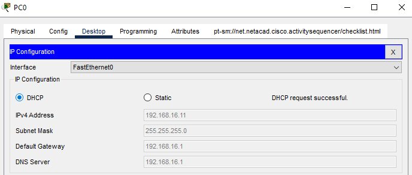
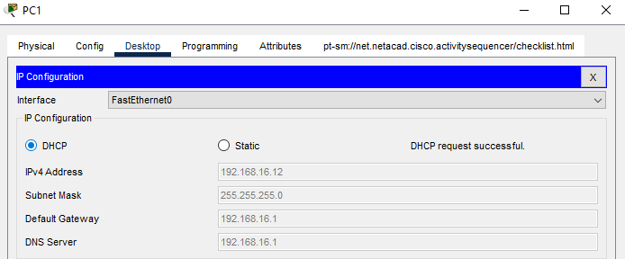
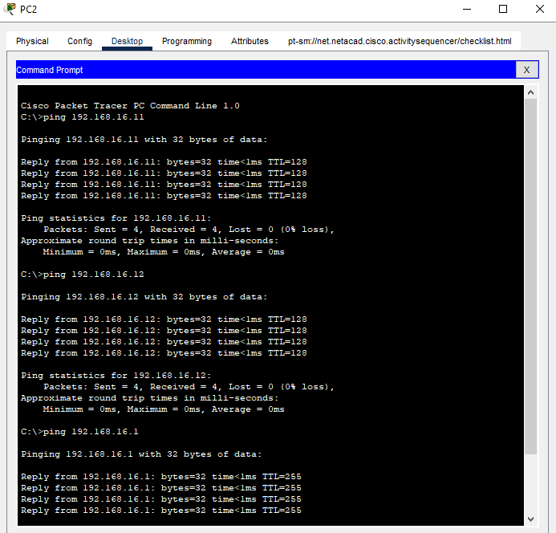

### Objectives

Upon the completion of this project, you will be able to configure a layer 3 switch as a dhcp server;

- Design the topology and provide the network devices needed
- Enable Multilayer Switch routing capability
- Convert the Multilayer Switch from Layer 3 Switchport to Layer 3 Interface
- Enable a Multilayer switch as a DHCP Server
- Assign the IP addresses to the PCs automatically using DHCP
- Test connectivity between devices

### Prior Knowledge

Prior to this project, you have learned the basics of computer networking specifically dynamic host configuration protocol and the configurations of networking devices.

{: .prompt-info}

> - This project focuses specifically on the configuration of a dhcp service on a Layer 3 switch alone and not the full configuration of a switch.
>
> - The project uses the **Cisco Packet Tracer** to show virtual configurations of the dhcp service on the Layer 3 Switch.

### Instructions

### Step 1: Design the topology and provide the network devices needed

a. Select any of the multilayer switch from the bottom toolbar, **Switches** in **Network Devices**. Choose the **3560-24PS Multiplayer Switch** from the cisco packet tracer options.

{: .prompt-tip}

> Multilayer Switch is a Layer 3 Switch according to OSI Model

b. Select the normal type of switch. Choose **2960** switch option.

c. Select three PCs from **End Devices** tab, to test connectivity after configuration of the multilayer switch

d. Connect the devices using the network devices. Use the **lightening-bolt** tool from the **Connections** to automatically connect devices using the appropriate cables.

### Step 2: Enable Multilayer Switch Routing Capability.

a. Click the **Multilayer Switch** to open it configuration window

b. Click the **CLI** tab to open the command line terminal to configure the Multilayer Switch.

c. Enter the following commands to enable routing capability

```terminal
Switch>enable
Switch#configure terminal
Switch(config)#ip routing
```

### Step 3: Convert the Multilayer Switch from Layer 3 Switchport to Layer 3 Interface

First, hover the cursor on the cable connected to the multilayer switch to reveal the interface. From my project, the interface is Gig0/1
a. Enter the following command in the global configuration mode

```terminal
Switch(config)#interface g0/1
Switch(config-if)#no switchport
```

### Step 4: Assign IP Address to the Interface

We will assign it the ip address of **192.168.16.1** and a subnet mask of **255.255.255.0**.

```terminal
Switch(config-if)#ip address 192.168.16.1 255.255.255.0
Switch(config-if)#exit
```

### Step 5: Enable DHCP service on the Multilayer Switch.

First, you enable the service and then name the dhcp pool. We will name the dhcp pool as **IT-DEPT** and assign it a network of **192.168.16.0** with a default gateway of **192.168.16.1**.

```terminal
Switch(config)#service dhcp
Switch(config)#ip dhcp pool IT-DEPT
Switch(dhcp-config)#network 192.168.16.0 255.255.255.0
Switch(dhcp-config)#default-router 192.168.16.1
Switch(dhcp-config)#dns-server 192.168.16.1
Switch(dhcp-config)#exit
```

{: .prompt-tip}

> The dns server address 192.168.16.1(not particularly correct), is used to show that the dns server should be configured too.

### Step 6(Optional): Exclude Specific IP Addresses from the DHCP service.

You will like to exclude certain IP addresses, so as to assign them statically to particular devices of choice or importance such as the printer.

```terminal
Switch(config)#ip dhcp excluded-address 192.168.16.1 192.168.16.10
```

### Step 7: Save the configurations.

```terminal
Switch(config)#do write
```

Close Multiplayer Switch configuration window

### Step 8: Assign IP Addresses to the PCs

a. Click open the configuration window of each PCs(**PC0, PC1, PC2**) one after the other and select the **IP Configuration** from the **Desktop** tab.  
b. Switch from **Static** to **DHCP** by clicking on the **DHCP** option. This automatically assigns IP addresses to these devices from the DHCP Server, which is the Multilayer Switch.

{: .prompt-info}

> Notice the **"DHCP request is successful"** information

{: width="400" height="427" }

{: width="400" height="427" }

{: width="400" height="427" }

{: .prompt-tip}

> Observe and note the IP addresses of the PCs and note also that the addresses are not part of the ones excluded from the dhcp service pool.
>
> Also, the ip addresses of each PCs may vary in your project from the ones on this article but will be within the network **192.168.16.0 /24**. This is due to the DHCP request time of each PCs.

### Step 9: Test Connectivity between PCs

Select anyone of the PCs to ping the others for connectivity.

a. Click **PC2** to open the configuration window, select the **Command Prompt** from the **Desktop** tab to open the command line interface

b. Ping **PC1** using its IP address.

{: .prompt-tip}

> The ping should be successful, else check the DHCP service configuration on the Multilayer Switch.

{: width="400" height="427" }

c. Try pinging **PC0** from **PC2** or using **PC0** or **PC1** to ping the other PCs or even the Multilayer Switch using the IP address assigned to it.

{: .prompt-tip}

> Click the <a href="/assets/cpt-file/layer3-switch-as-dhcp-server/layer3-switch-as-dhcp-server-packet-tracer-file.pkt" title="Download" download>Layer 3 Switch as DHCP Server </a> to download the packet tracer file and to view the project.
