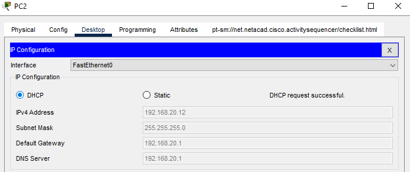

### Objectives

Upon the completion of this project, you will be able to configure a router as a dhcp server;

- Design the topology and provide the network devices needed
- Configure and assign address to the Router inteface
- Enable a Router as a DHCP Server
- Assign the IP addresses to the PCs automatically using DHCP
- Test connectivity between devices

### Prior Knowledge

Prior to this project, you have learned the basics of computer networking specifically dynamic host configuration protocol and the configurations of networking devices.

{: .prompt-info}

> - This project focuses specifically on the configuration of a dhcp service on a router that does not have dhcp preconfigured service.
>
> - The project uses the **Cisco Packet Tracer** to show virtual configurations of the dhcp service on the router.

### Instructions

### Step 1: Design the topology and provide the network devices needed

a. Select any of the routers from the bottom toolbar , **Routers** in **Network Devices**. Choose the **2911 Router** from the cisco packet tracer options.

b. Select a switch. Choose **2960** switch option.

c. Select three PCs from **End Devices** tab, to test connectivity after configuration of the router

d. Connect the devices using the network devices. Use the **lightening-bolt** tool from the **Connections** to automatically connect devices using the appropriate cables.

### Step 2: Configure and Assign IP Address to the Router Interface

Hover the cursor on the cable connected to the router to reveal the interface. From my project, the interface is Gig0/0.
We will assign it the ip address of **192.168.20.1** and a subnet mask of **255.255.255.0**.
Enter the following commands in the global configuration mode of the **CLI** tab of the Router configuration window;

```terminal
Router>enable
Router#configure terminal
Router(config)#interface g0/0
Router(config-if)#ip address 192.168.20.1 255.255.255.0
Router(config-if)#no shutdown
Router(config-if)#exit
```

### Step 3: Enable DHCP service on the Router.

First, you enable the service and then name the dhcp pool. We will name the dhcp pool as **ADMIN-DEPT** and assign it a network of **192.168.20.0** with a default gateway of **192.168.20.1** which is the ip address of the router.

```terminal
Router(config)#service dhcp
Router(config)#ip dhcp pool ADMIN-DEPT
Router(dhcp-config)#network 192.168.20.0 255.255.255.0
Router(dhcp-config)#default-router 192.168.20.1
Router(dhcp-config)#dns-server 192.168.20.1
Router(dhcp-config)#exit
```

{: .prompt-tip}

> The dns server address 192.168.20.1(not particularly correct), is used to show that the dns server should be configured too.

### Step 4(Optional): Exclude Specific IP Addresses from the DHCP service.

You will like to exclude certain IP addresses, so as to assign them statically to particular devices of choice or importance such as the printer.

```terminal
Router(config)#ip dhcp excluded-address 192.168.20.1 192.168.20.10
```

### Step 5: Save the configurations.

```terminal
Router(config)#do write
```

### Step 6: Assign IP Addresses to the PCs

a. Click open the configuration window of each PCs(**PC1, PC2, PC3**) one after the other and select the **IP Configuration** from the **Desktop** tab.  
b. Switch from **Static** to **DHCP** by clicking on the **DHCP** option. This automatically assigns IP addresses to these devices from the DHCP Server, which is the Router.

{: .prompt-info}

> Notice the **"DHCP request is successful"** information

{: width="400" height="427" }

{: width="400" height="427" }

{: width="400" height="427" }

{: .prompt-tip}

> Observe and note the IP addresses of the PCs and note also that the addresses are not part of the onces excluded from the dhcp service pool.

### Step 7: Test Connectivity between PCs

Select anyone of the PCs to ping the others for connectivity.

a. Click **PC3** to open the configuration window, select the **Command Prompt** from the **Desktop** tab to open the command line interface

b. Ping **PC2** using its IP address.

{: .prompt-tip}

> The ping should be successful, else check the DHCP service configuration on the Router

{: width="400" height="427" }

c. Try pinging **PC1** from **PC3** or using **PC1** or **PC2** to ping the other PCs or even Router using its the IP address assigned to it which is also the default gateway of the PCs.

{: .prompt-tip}

> Click the <a href="/assets/cpt-file/router-as-dhcp-server/router-as-dhcp-server-packet-tracer-file.pkt" title="Download" download>Router as DHCP Server </a> to download the packet tracer file and to view the project.
