Mastercard Virtual Experience Program on Forage is a cybersecurity job simulation focused on creating security awareness against phishing emails by educating the staff at Mastercard or other organizations.  
There are two tasks you will be working on, which are:  
**Task 1**: Design a phishing email simulation - here, you will identify what a phishing email looks like, what an obvious fake email is, and finally simulate and create a good phishing email.

**Task 2**: Interpret phishing simulation results - here, you will identify which areas of the business need more awareness about phishing, and then design and create a short presentation to help teams improve security awareness.

## Task 1: Design a phishing email simulation

### Task Overview

What you will learn:

- What threat phishing presents to an organization
- What different types of phishing emails look like
- How Mastercard prevents and mitigates phishing threats

What you will do:

- Examine an obvious fake email and make it more believable

### Background: Let’s give you some context

You are an analyst in our Security Awareness Team
Our Chief Security Officer (CSO) relies on our team to help our staff learn how to identify and report security threats to Mastercard.

One of the most common threats organizations face today is **phishing**. So, what is phishing?

- Phishing is the act of pretending to be someone/something to get information, in most cases, this is usually a password.
- Attackers may send links or attachments designed to infect the recipient’s system with malicious software or lure them into providing financial information, system credentials or other sensitive data.

- Successful phishing attempts can cost companies like Mastercard millions of dollars and put out employees at risk. So it is very important that we keep the business and our staff safe from harm.

At Mastercard, one of the ways we mitigate phishing threats is by educating our people about the risks and how to identify them. An effective way to build awareness is through phishing simulation campaigns:

- We test our staff every month by sending a fake phishing email that is made to look like something a bad actor would send
- We use the results of the simulated test to help us design and implement future training.

### What can a phishing email look like?

A few months back, we detected a phishing email that was being used by an external bad actor on some of our employees. Thankfully, it failed due to being an obvious fake. However, we know that phishing emails are now getting very sophisticated and a range of tactics are used

Let’s learn what an "obvious fake" might look like

#### What is the first issue you spot in this phishing email?

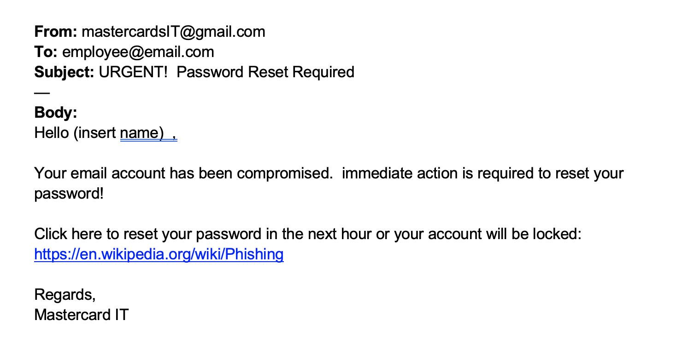

Here, you can identify the following:

- Suspicious looking source email address: First of all, there is a typo in the email address. You can also see that it is coming from the gmail, not a Mastercard email.

- Email body: The layout is sloppy and poorly formatted. The hyperlink is suspicious, as it does not look like it is from Mastercard.

#### How could do you improve the body of the phishing email to make it more believable?

- Improve the spelling, grammar and sloppy layout
- In addition to this, the hyperlink could be masked in plaintext.

### Task: Your task is to create a believable phishing email

Your manager wants you to lead Mastercard’s next phishing simulation campaign. This is an awesome opportunity for you to step up and show what you can do.

The first step is to create the fake phishing email to use in the simulation.

You have just seen what an ‘obvious fake’ looks like, so it is important to make yours contextual and believable to increase the likelihood of an employee clicking on the phishing link.

#### Creating a Phishing Link

Utilizing the social engineering toolkit (setoolkit), you will create a phishing link that will direct the staff to a cloned Mastercard staff login website. This phishing link will then be masked in plaintext in the email content and used to gather their personal login details.  
You will use the original Mastercard staff login website that is : **https://cashpassport.mastercard.com/mcstaff/login/**

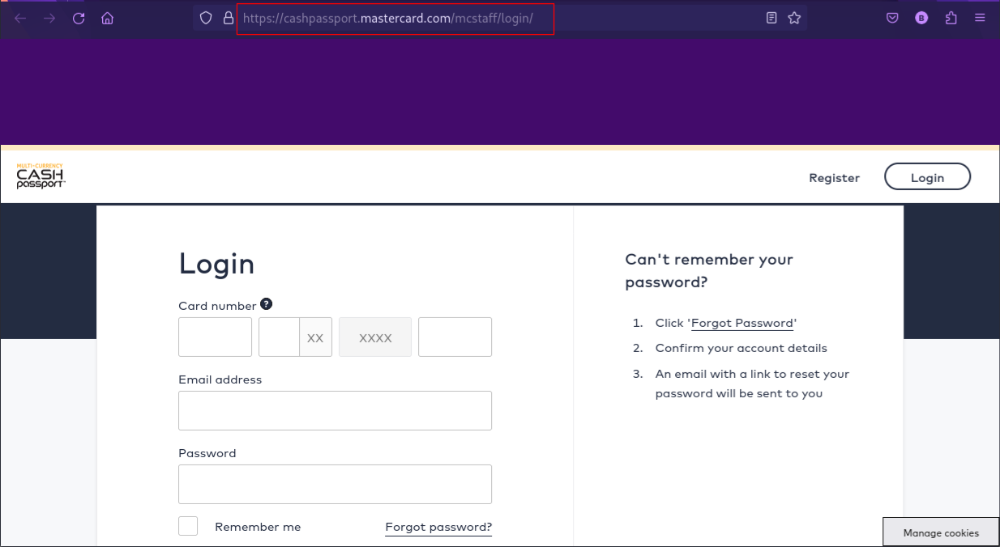

**The following steps will guide you in creating a phishing link:**

{: .prompt-warning}

> This is restrictly for educational purposes. Do not you use for negative reasons.

a. Start up the **setoolkit** on your Linux terminal. The tool comes preinstalled on Kali and some other Linux distros.  
 Use the command to run it the root mode:

```terminal
sudo setoolkit

```

b. Type **1** to select the **Social-Engineering Attacks** and click enter

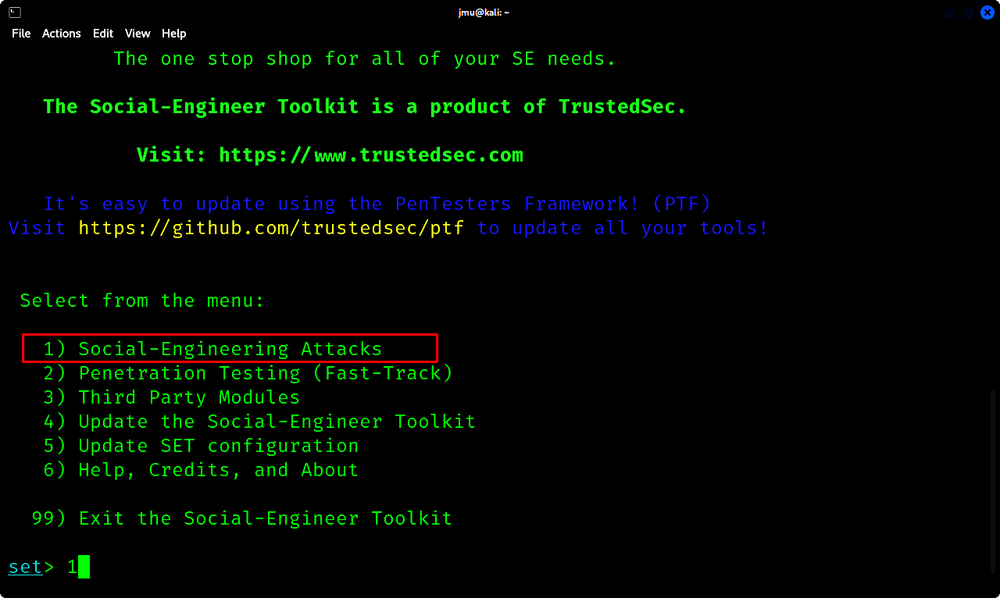

c. Select **2** for **Website Attack Vectors**

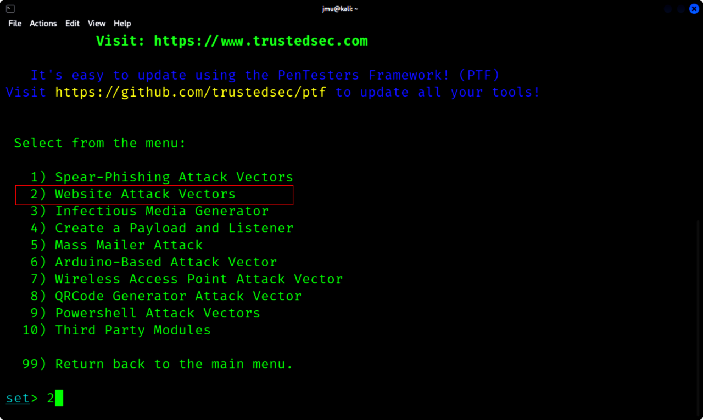

d. Select the **Credential Harvester Attack Method**

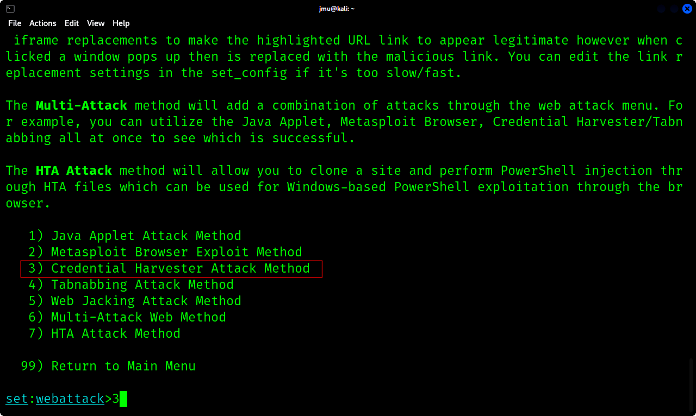

e. Select the **Site Cloner** option. This will be used to clone the original login website.

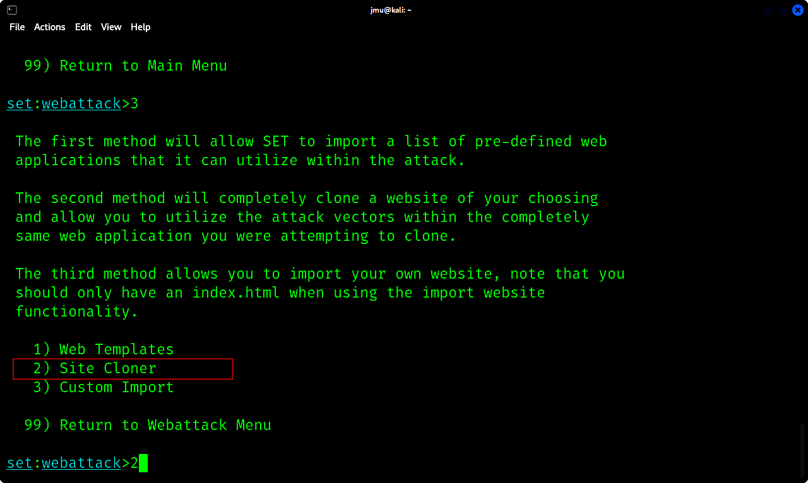

f. Input the ip address that will be the address for the website. I will use ip address of my device **192.168.159.16**

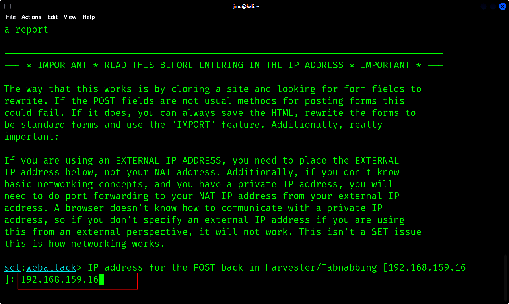

g. Enter the url you want to clone: **https://cashpassport.mastercard.com/mcstaff/login/**

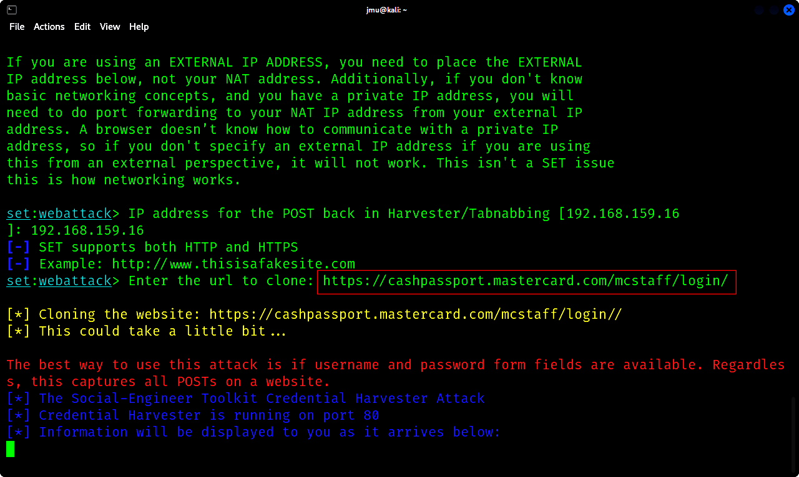

h. You will now input the ip address **192.168.159.16** into your browser. You will observe that the original login website has been cloned successfully.

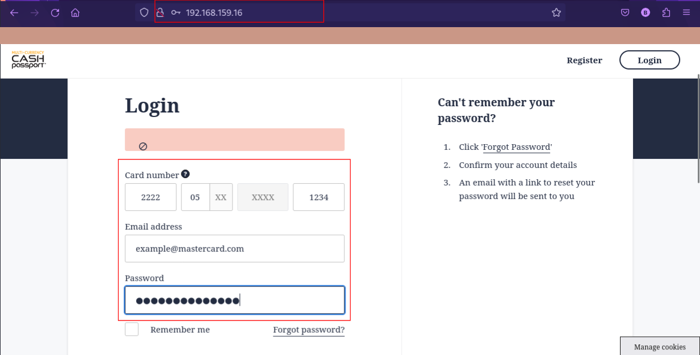

i. Any staff member that inputs their personal login details on the phishing link and clicks on **Login**, the details will be captured on our device.

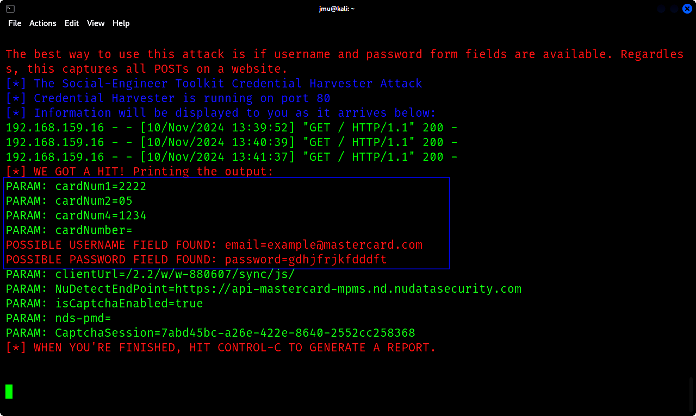

{: .prompt-tip}

> The phishing link **http://192.168.159.15/** will now be used in the email content and masked as plaintext.

#### Improving the phishing email

You will recreate and improve the obvious fake email to make it more believable.  
Remember the end goal is to encourage the user to click on the link.

{: .prompt-info}

> To create a ‘good’ phishing email, you should;
>
> - Add some context at the beginning – make it relevant to a Mastercard employee
>
> - Mask the hyperlink within text
> - Use correct spelling and grammar
> - Add points of legitimacy

#### Example of Phishing Email

Below you will find one example of an improved phishing email – take note of some of the improvements made.

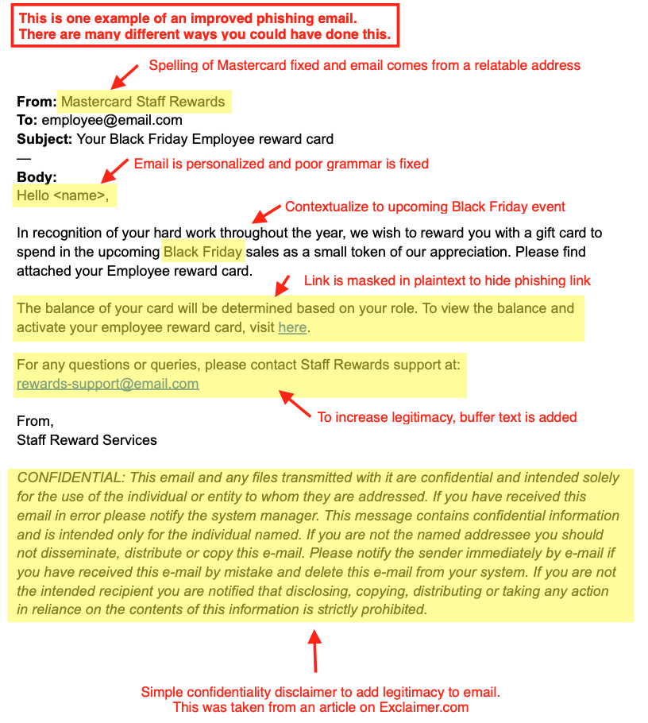

{: .prompt-tip}

> There are many ways you could have created the email, as phishing emails come in all shapes and sizes. But make sure the email is relevant to the proposed victim, well formatted, grammatically correct and believable.

## Task 2: Interpret phishing simulation results.

### Task Overview

What you will learn

- How to identify which areas of the business need more awareness about phishing
- How to design and implement the appropriate training for those teams to lower our risk of an attack

What you will do

- Create a short presentation to help teams improve security awareness

### Background: It is time to identify and train you teams.

The phishing simulation designed in the first task was run last week. So, what is next?  
We have used some tools to analyze the results and we can see the failure rate of each department. It is clear that some teams appear more likely to fall for a phishing email than others.
Now that we have these results, we need to:

- Identify which areas of the business need more awareness about phishing, and

- Design and implement the appropriate training for those teams to lower our risk of an attack.

### Interpret the results

First, let’s have a look at the results of the phishing campaign.
This table helps you to identify which teams appear to be more likely to fall for phishing email than others.

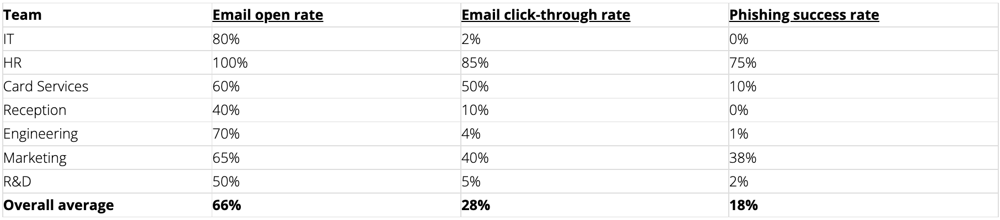{: width="1600"}

{: .prompt-info}

> Here are some resources to help you  
> The percentages shown are based off the total number of staff members who received the email.  
> For example if 100 people received the email and 50 people opened it – the email open rate would be 50%.
>
> - Email open rate = the percentage of people that opened it
>
> - Email click-through rate = the percentage of people that clicked on the link
> - Phishing success rate = the percentage of people that clicked the link and inputted some personal information.

**Which teams performed poorly in the phishing simulation?**

From the table above, it can be observed that HR and Marketing teams performed poorly in the simulation as the percentage of people that clicked the link and inputted some personal information is above the average of the percentage of people that opened it. Hence, exposing their poor security awareness against phishing, so they should receive further training.

### Task: Create a short presentation

Now that you have analyzed the results, it is time to create a short presentation (3-5 slides) providing some awareness and training materials for the two teams that appear to be most susceptible. This will help us improve the security awareness of the teams that performed poorly in this campaign.

Remember that employees at times view training as boring – so try to make the presentation clear, concise and easy to understand. Try to educate employees on what phishing is, as well as provide examples of tactics often used. Use any resources you choose, the more creative the better.

### Example Presentation

Take a look at this example presentation, which has been prepared by a Security Awareness professional at Mastercard, to learn how they would have approached this task

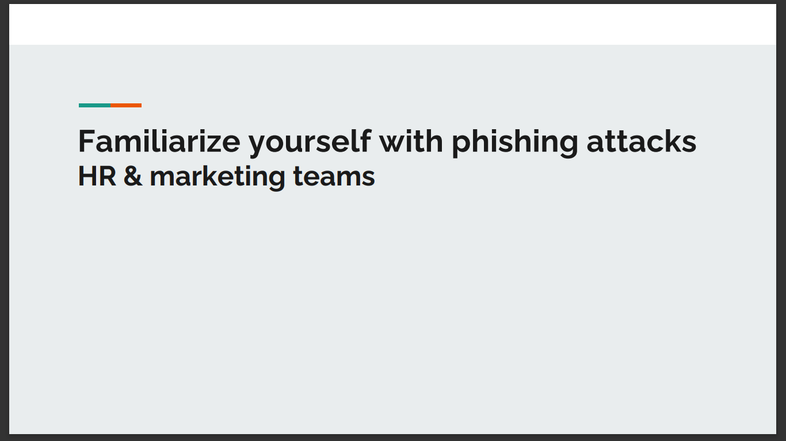

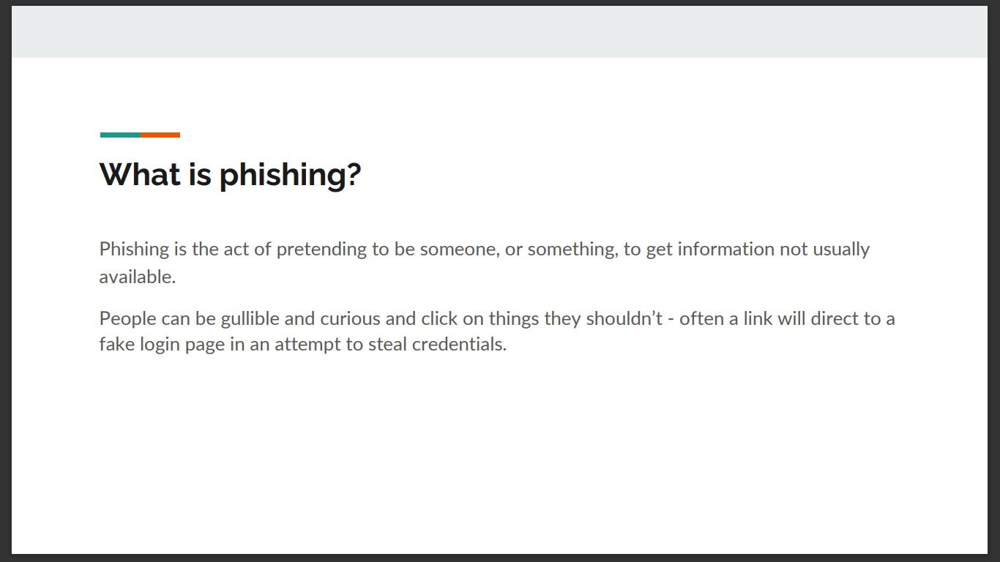

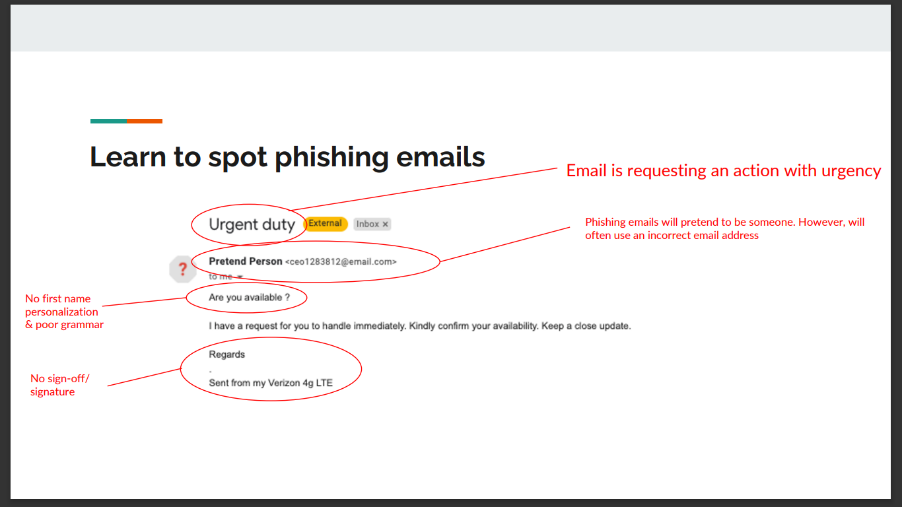

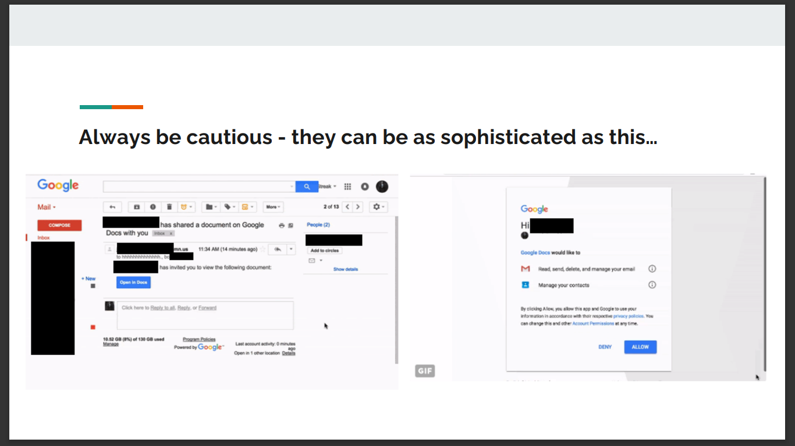

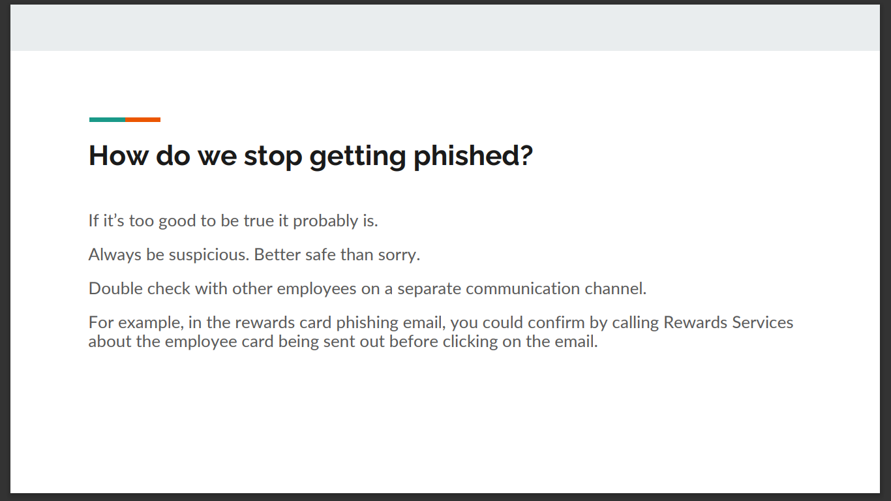

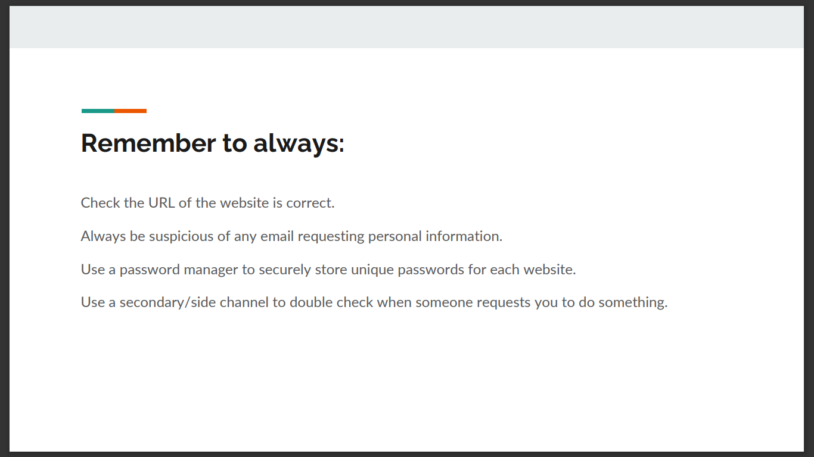

{: .prompt-tip}

> The main takeaway points from the example presentation include:
>
> 1. The of use contextual and visual examples of how to spot phishing emails.
>
> 2. The presentation is clear, concise and heavy on the visuals.
>
> 3. The action points provided are clear and concise.
