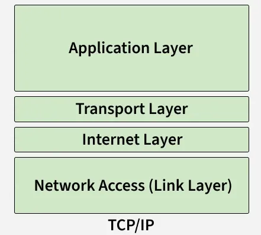
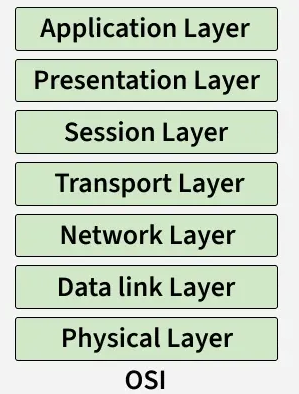
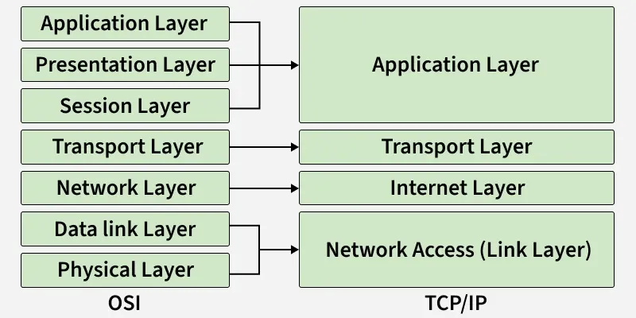
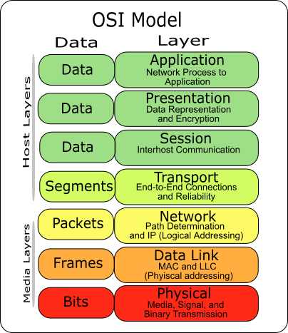

## Network Communications

The connection of two or more end devices through a network medium is called **Network**.

The communication between these devices is called **Network Communciation**. All computers connnected to a network that participate directly in network commmunication are called **Hosts**.

Hosts can send and receive messages on the  network. In modern networks, computer hosts can act as a client, server or both. The software installed on the  computer determines which role the computer plays.

**Servers** are hosts that have software installed which enable them to provide information like email or webpages, to other hosts on the network. Each service requires separate server software. For example, a host requires web server software in order to provide web services to the network.

**Clients** are computer hosts that have software installed that enables the hosts to request and display the information obtained from the server. An example of client software is a web browser, such as Internet Explorer, Safari Mozilla Firefox or Chrome.

The rules or standards that govern these communications are called Protocols.

Successful communication between hosts requires interaction betweena a number of protocols, which include HTTP, TCP, IP, and Ethernet. These protocols are implemented in the software and hardware that are installed on each host and networking devices. The interaction between the different protocols on a device can be illustrated as a **protocol stack**.

## Network Models

The network models are layered models that help us visualize how the various protocols work together to enable network communication.
There are two basic types of models that we use to describe the functions that must occur in order for network communication to be successful.

### Protocol Model

This model closely matches the structure of a particular protocol suite. A protocol suite includes the set of related protocols that typically provide all the functionality required for people to communicate with the data network. The TCP/IP model is a protocol model because it describes the functions that occur at each layer of protocol within the TCP/IP suite.

### Reference Model

This type of model describes the functions that must be completed at a particular layer but does not specify exactly how a function should be accomplished. A reference model is not intended to provide a sufficient level of detail to define precisely how each protocol should work at each layer.
The primary purpose of a reference model is to aid in clearer understanding of the functions and process necessary for network communications.

### TCP/IP Model

{: width="400" height="427" }

The first layered model for internetwork communications was created in the early 1970s and is referred to as internet model. It defines four categories of functions that must occur in order for communications to be successful. The suite of TCP/IP protocols that are used for internet communication follow the structure of this model. Because of this , the internet model is commonly referred to as the TCP/IP model.

|||
|-----|-------|
|**Application**|Represents data to the user, plus encoding and dialog control|
|**Transport**|Supports communication between various devices across diverse networks.|
|**Internet**|Deternines the best path through the network|
|**Network Access**|Controls hardware devices and media that make up the network|
|||

### OSI Reference Model

{: width="400" height="427" }

The most widely known internetwork reference model was created by the Open System Interconnection (OSI) project at the International Organization for Standardization (ISO). It is used for data network design, operation specifications, and troubleshooting. This model is commonly referred to as the OSI model.

|||
|-----|-------|
|**Application**|The application layer contains protocols used for process-to-process communications|
|**Presentaion**|The presentation layer provides for common representation of the data transferred between application layer services|
|**Session**|The session layer provides services to the presentation layer to organise its dialogue and to manage data exchange.|
|**Transport**|The transport layer defines services to segment, transfer and resemble the data for individual communications between the end devices.|
|**Network**|The network layer provides services to exchange the individual pieces of data over the network between indentified end devices|
|**Data Link**|The data link layer protocols describes methods for exchanging data frames between devices over a common media.|
|||

### OSI Model and TCP Model Comparison

{: width="400" height="427" }

The key similarities are in the transport and network layers; however, the two models differ in how they relate to the layers above and below each layer.

Note the following;

OSI layer 3, the network layer, maps directly to the TCP/IP are used to describe protocols that address and route messages through and internetwork.

OSI layer 4, the transport layer, maps directly to the TCP/IP transport layer. This layer describes general services and functions that provide ordered and reliable delivery of data between source and destination hosts.

The TCP/IP application layer includes several protocols that provide specific functionality to a variety of end user applicationss. The OSI model layers 5,6 and 7 are used a references for application software developers and vendors to produce applications that operate on networks.

Both the TCP/IP and OSI models are commonly used when referring to protocols at various layers. Because the OSI models separate the data-link layer from the physical layer, it is commonly used when referring to these lower layers.

### Understanding Each Layer of the OSI Model and its Protocols

#### Layer 1: Physical

This is where the encapsulated data unit is first transformed into raw bits and then converted into signals during transmission through network media to its destination.
The media maybe copper wire, fibre-optic cable or electromagnetic waves through the air.

The signals maybe, either through

1. Electrical signal which is a series of pulses of electricity on a copper wire or LAN cable.
2. Optical Signals: which is pulses of light on fibre-optic cable.
3. Wireless signal which is radio waves or infrared through the air.

Signals may be converted many times before ultimately reading  the destination as corresponding media changes between source and destination.

Also, note the computer data exists in form of bits(binary digits i.e 1s and 0s)

The common network cables are;

>- twisted pair cable
>- Coaxial cable
>- Fibre-optic cable

{: .prompt-info }

>This layer works with **bits**

#### Layer 2: Data-Link

In this layer, the raw bits from Layer 1 is converted into frames or the packets from Layer 3 is converted to frames.

The Layer 2 technology uses wired or wireless network technology.

##### Wired Network Technology

Ethernet protocol is the most commonly implement wired protocol because it uses a suite of protocols that allow network devices to communicate over a wired LAN connection. And ethernet LAN can connect devices using any of the following types of cable which are, the twisted-pair cable, coaxial cable fibre-optic cable.

Devices access the  ethernet LAN using an Etherenet Network Interface Card (NIC). Each Ethernet NIC has a unique address permanently embedded on the card known as a Media Access Control (MAC) address. The MAC address for both the source and destination are fields in an Ethernet Frame.

##### Wireless Network Technology

Wifi which is wireless LAN (WLAN) technology uses radio signals to connnect devices to router or a access point without physical cables. The wireless standards for LANs use the 2.4GHz and 5GHz frequency bands.

Layer 2 uses MAC address to identify devices on a local network.

It provides error detection, that is, it checks if data is damaged.

Controls who uses the network at a time, that is flow control.

Makes sure data goes to the right device in the same network.

The devices that use the layer 2 technology are switches, bridges, NICs (Network Interface Cards).

Ensures delivery within the same local network.

{: .prompt-info }

>The data is layer 2 is called **frame**.

#### Layer 3: Network

In this layer, the goal is an end to end delivery, that is from the source to the destination. Uses an addressing scheme called the Interne Protocol (IP) addresses during this delivery.

It handles routing between different networks.

It decides the best path to reach a destination.

The devices used are routers, layer-3-switches.

The common protocols are IP(IPv4/IPv6), ICMP, etc.

{: .prompt-info }
>The data used here is called packets.

#### Layer 4: Transport

In this layer, the goal is to provide an end to end communication between multiple applications simultaneously (ports).

It ensures reliability (TCP) or speed (UDP).

The common protocols are TCP and UDP.

It distinguishes data streams.

It uses addressing scheme called ports.

TCP is connection oriented and UDP is connectionless communication.

It establishes and terminate sessions.

It also functions as error recovery, flow control and sequencing.

Here in this layer, the servers listen for request to predefined ports.

Clients select random port for each session connection.

{: .prompt-info }

>The data unit is called **segments** for TCP and **datagrams** for UDP.

#### Layer 5: Session

In this layer, it manages sessions (Connections) between end-user application processes of devices.

It handles setup, management and termination of communication.

Examples of protocols used in this layer include NetBIOS, RPC.

{: .prompt-info }

>Its data unit is called **data**.

#### Layer 6: Presentation

It translates and presents data into a format the application can use.

It handles encryption, compression and encoding of data.

SSL/TLS, JPEG, MP3, GIF, uses the layer 6 technology.

#### Layer 7: Application

This is closest to the end user as it is the apps and services.

Provides network services such as email, web, file transfer.

Protocols used  in this layer include HTTP, HTTPS, FTP, SMTP, DNS.

{: .prompt-info }

>The unit is called data

{: width="400" height="427" }