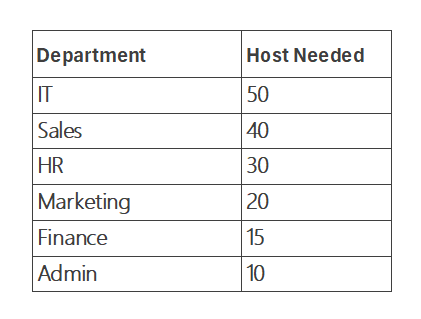
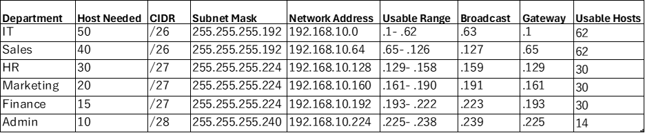
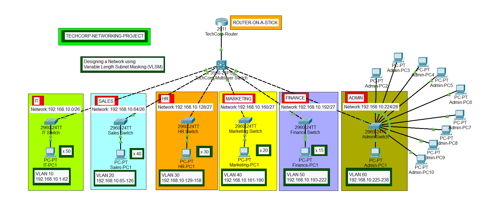
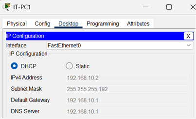
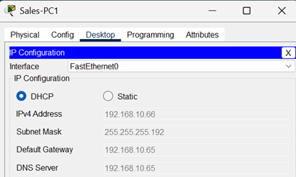

# Case Study

A growing company, TechCorp has recently expanded and needs to reorganize its network to improve performance and security. The company currently has one large network with the IP range **192.168.10.0/24**, which supports up to 254 devices (hosts). However, they want to divide this network into smaller subnets to separate different departments and reduce network congestion.

## Objective

TechCorp needs to create 6 subnets for different departments: HR, IT, Sales, Marketing, Finance and Admin. Each department has different numbers of employees, and the network needs to accommodate future growth, ensuring that each subnet has enough IP addresses for its devices.



A single **/24** gives 256 ip addresses with only 254 usable addresses. Split evenly six ways, that is about 42 each, which is plenty for HR or Marketing, but not enough for IT. The goal is to give every department exactly the room it needs, without over- or under-provisioning.

## The Method

These rules make VLSM straightforward:

1. **Order departmets from largest to smallest:**  
    We arrange the number of hosts or IP addresses required from the largest to the smallest as we perform VLSM subnetting. This prevents a small subnet from accidentally splitting a block that a larger one might need later. The total host needed for our network is 165 hosts, and we will perform VLSM on the IT sub-network first because of its larger host requirement.

2. **Determine the class of IP subnet:**  
    We need to determine the class of IP subnet that we will use based on the required number of hosts. Class A has 16,777,216, Class B has 65,536, and Class C has 256 IP addresses. Based on our network requirement, we need only 165 hosts, therefore, we will use a Class C IP address space. From our case study, we have been provided with 192.168.10.0. Also, it could be that the organization bought an IP address space from the IP address authorities.

3. **Identify the host bits for every subnet and find the smallest block that fits:**  
   From our host requirements, the IT subnet needs 50 hosts, and using the formula;  
   **2<sup>n</sup> - 2 &ge; hosts needed**  
   where *n* is the smallest and closest number of host bits that fits and *-2* accounts for the network and broadcast addresses that every subnet reserves.  
   Therefore, we will try to use 6 host bits, which will give us 64 hosts, minus 2 from the hosts for the network address and broadcast address, which will give 62 usable host address needed, *(i.e 2<sup>6</sup> - 2 = 62 hosts )*. And it meets our 50 hosts requirement for the IT subnet.

4. **Calculate the subnet mask:**  
   Identify the network bits and determine the subnet mask of the subnet. We can get the subnet mask by subtracting the host bits from 32 (the total IPv4 address bits). For IT subnet, it is 32 - 6 host bits, which is equal to 26. The subnet mask for IT is **/26** and its long format is **255.255.255.192**

5. **Determine the block size:**  
   To determine the block size, that is the increment, we can use the formula;  
   **2<sup>n</sup> = block size; (n = the host bits)**.  

   For IT, it is 6 host bits, which will give us the block size of 64. The first and the last address of the IP address block will be the network and the broadcast addresses respectively, while the remaining is the host usable IP address range.

### Working through each department  

**IT (50hosts):** A **/27 (5 bits)** only offers 30 usable addresses, too small. A **/26 (6 bits)** offers 62, the fit.  
**Sales(40 hosts):** Same story, 30 is not enough, so Sales also needs a **/26**.  
**HR (30 hosts):** A **/27** gives exactly 30 usable addresses, a perfect fit.  
**Marketing(20 hosts):** A **/27** fits, with some room to grow.  
**Finance (15 hosts):** A **/28(4 bits)** only gives 14 usable, one short, it needs a **/27**.  
**Admin (10 hosts):** A **/28** gives 14 usable, the smallest block that still fits.

## The Subnet Result



 This allocates 240 of the 256 addresses in the **/24**, leaving **192.168.10.240/28** (16 addresses) in the reserve, room for a future department, a router link, or management VLAN, without re-numbering anything already deployed.

## Topology

 

 Each subnet maps to it own switch, connected to a central router that handles inter-department routing (either via router-on-a-stick with subinterfaces, or an L3 switch with SVIs). Every devices default gateway is the first usable address in its subnets.

## Configurations

### Step 1: Create vlans on the interfaces of the departments switches and change the ports to access mode

Click to open the **IT Switch** box, in the **CLI** tab, on the interfaces, create vlan 10 and switch the ports to access mode.

```terminal
Switch>enable
Switch#configure terminal
Switch(config) #vlan 10
Switch(config-vlan) #name IT-VLAN
Switch(config-vlan) #interface range fa0/1-24
Switch(config-if-range) #switchport mode access
Switch(config-if-range) #switchport access vlan 10
Switch(config-if-range) #do wr
Switch(config-if-range) #exit
```

{: .prompt-info }

> To check for the creation of the vlan:  
> Switch(config)# do show vlan

Do the same for the other switches while creating their respective vlans according to the topology design.

### Step 2: Create vlans on the TechCorp Multilayered Switch and change the ports mode to access

Click to open the **TechCorp Multilayered Switch** box, in the **CLI** tab, on the interface facing the layer 2 switch, create the respective vlan and change the port to access mode for the department subnets.

For the IT subnets,

```terminal
Switch>enable
Switch#configure terminal
Switch(config) #vlan 10
Switch(config-vlan) #name IT-VLAN
Switch(config-vlan) #interface fa0/2
Switch(config-if) #switchport mode access
Switch(config-if) #switchport access vlan 10
Switch(config-if) #do wr
Switch(config-if) #exit
```

Still on the Multilayered Switch, change the interface connected between the Multilayered Switch and the TechCorp Router to trunk mode. The interface from the topology is fa0/1.

```terminal
Switch(config-if) #switchport trunk encapsulation dot1q
Switch(config-if) #switchport mode trunk
Switch(config-if) #do wr
Switch(config-if) #exit
```

Do the same for other subnets, on the respective Multilayered Switch interfaces facing the different layer 2 switches.

### Step 3: Implement Inter-VLAN routing on the TechCorp Router by creating subinterfaces

We assign ip address details to the subinterfaces on the router, using the Router on a Stick(ROAS) method.

For IT subnet,

```terminal
Router>enable
Router#configure terminal
Router(config) #interface g0/0
Router(config-if) #no shut
Router(config-if) 
Router(config-if) interface g0/0.10
Router(config-subif)#encapsulation dot1q 10
Router(config-subif)#ip address 192.168.10.1 255.255.255.192
Router(config-subif)#do wr
Router(config-subif)#exit

```

For Sales subnet, on the same router CLI,

```terminal
Router(config-if) interface g0/0.20
Router(config-subif)#encapsulation dot1q 20
Router(config-subif)#ip address 192.168.10.65 255.255.255.192
Router(config-subif)#do wr
Router(config-subif)#exit
```

### Step 4: Implement DHCP on subinterfaces to assign ip addresses to the subnets

You will enable dhcp server on the router to automatically assign host devices on each subnets, ip addresses and subnet masks for communication.

Still on the TechCorp Router, in the CLI tab, enable dhcp service in the global configuration mode.

```terminal
Router(config)# service dhcp
```

For IT subnet, create a dhcp pool with the network 192.168.10.0/26.

```terminal
Router(config) #ip dhcp pool IT-POOL
Router(dhcp-config) #network 192.168.10.0 255.255.255.192
Router(dhcp-config) #default-router 192.168.10.1
Router(dhcp-config) #dns-server 192.168.10.1
Router(dhcp-config) #exit
Router(config) #do wr
```

For Sales subnet, create a dhcp pool with the network 192.168.10.64/26.

```terminal
Router(config) #ip dhcp pool Sales-POOL
Router(dhcp-config) #network 192.168.10.64 255.255.255.192
Router(dhcp-config) #default-router 192.168.10.65
Router(dhcp-config) #dns-server 192.168.10.65
Router(dhcp-config) #exit
Router(config) #do wr
```

Following the same dhcp configurations, create dhcp pool for other subnets on their respective subinterfaces.

### Step 5: Assign IP addresses to the Host devices in the subnets

Host devices can receive IP addresses whenever they connect to any of the subnets, as long as DHCP service is enabled on the router and on the host devices else they will be assigned manually. To connect our host devices to the network, click open the PCs, select **IP Configuration** after clicking on the **Desktop** tab, and then select **DHCP** option to dynamically assign ip adress details to the device.





### Step 6: Test for Connectivity between host devices

Using the PC of any of the subnet, ping the TechCorp Router or any other PCs to verify connectivity across networks.

{: .prompt-tip}

> Click the <a href="/assets/cpt-file/subnetting-project/transcorp-network-project.pkt" title="Download" download>Transcorp Network Project </a> to download the packet tracer file to view the project.

## Conclusion

 VLSM is not just about hitting host counts, it is about making a network that reflects the organization it serves and still has room to grow. Sizing largest to smallest and always choosing the tighest fitting block keeps the address spaces efficient without leaving any department boxed in.
